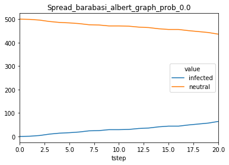
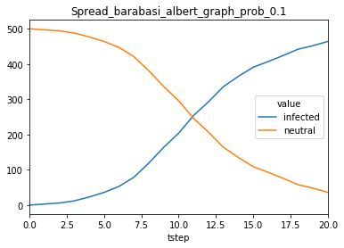
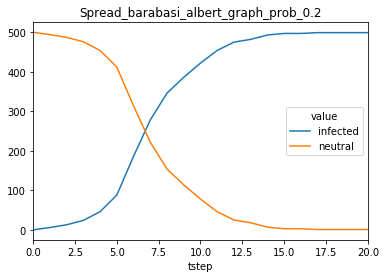
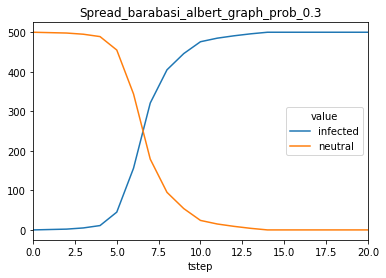
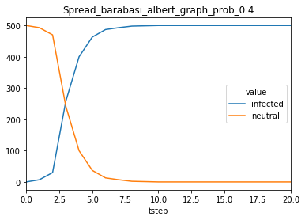
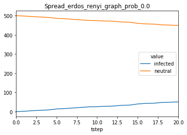
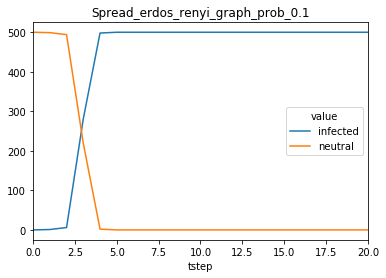
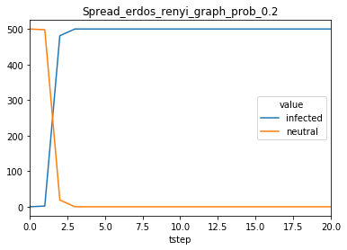
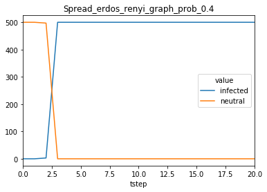

Developing new models
---------------------

Introduction
============

This notebook is an introduction to the soil agent-based social network
simulation framework. In particular, we will focus on a specific use
case: studying the propagation of news in a social network.

The steps we will follow are:

-  Modelling the behavior of agents
-  Running the simulation using different configurations
-  Analysing the results of each simulation

But before that, let's import the soil module and networkx.

.. code:: ipython3

    import soil
    import networkx as nx

.. code:: ipython3

    %pylab inline
    # To display plots in the notebook

.. parsed-literal::

    Populating the interactive namespace from numpy and matplotlib

Basic concepts
==============

There are three main elements in a soil simulation:

-  The network topology. A simulation may use an existing NetworkX
   topology, or generate one on the fly
-  Agents. There are two types: 1) network agents, which are linked to a
   node in the topology, and 2) environment agents, which are freely
   assigned to the environment.
-  The environment. It assigns agents to nodes in the network, and
   stores the environment parameters (shared state for all agents).

Soil is based on ``simpy``, which is an event-based network simulation
library. Soil provides several abstractions over events to make
developing agents easier. This means you can use events (timeouts,
delays) in soil, but for the most part we will assume your models will
be step-based.

Modeling behaviour
==================

Our first step will be to model how every person in the social network
reacts when it comes to news. We will follow a very simple model (a
finite state machine).

There are two types of people, those who have heard about a newsworthy
event (infected) or those who have not (neutral). A neutral person may
heard about the news either on the TV (with probability
**prob\_tv\_spread**) or through their friends. Once a person has heard
the news, they will spread it to their friends (with a probability
**prob\_neighbor\_spread**). Some users do not have a TV, so they only
rely on their friends.

The spreading probabilities will change over time due to different
factors. We will represent this variance using an environment agent.

Network Agents
++++++++++++++

A basic network agent in Soil should inherit from
``soil.agents.BaseAgent``, and define its behaviour in every step of the
simulation by implementing a ``run(self)`` method. The most important
attributes of the agent are:

-  ``agent.state``, a dictionary with the state of the agent.
   ``agent.state['id']`` reflects the state id of the agent. That state
   id can be used to look for other networks in that specific state. The
   state can be access via the agent as well. For instance:

   .. code:: py

       a = soil.agents.BaseAgent(env=env)
       a['hours_of_sleep'] = 10
       print(a['hours_of_sleep'])

   The state of the agent is stored in every step of the simulation:
   ``py   print(a['hours_of_sleep', 10]) # hours of sleep before step #10   print(a[None, 0]) # whole state of the agent before step #0``

-  ``agent.env``, a reference to the environment. Most commonly used to
   get access to the environment parameters and the topology:

   .. code:: py

       a.env.G.nodes() # Get all nodes ids in the topology
       a.env['minimum_hours_of_sleep']

Since our model is a finite state machine, we will be basing it on
``soil.agents.FSM``.

With ``soil.agents.FSM``, we do not need to specify a ``step`` method.
Instead, we describe every step as a function. To change to another
state, a function may return the new state. If no state is returned, the
state remains unchanged.[ It will consist of two states, ``neutral``
(default) and ``infected``.

Here's the code:

.. code:: ipython3

    import random
    
    class NewsSpread(soil.agents.FSM):
        @soil.agents.default_state
        @soil.agents.state
        def neutral(self):
            r = random.random()
            if self['has_tv'] and r < self.env['prob_tv_spread']:
                    return self.infected
            return
        
        @soil.agents.state
        def infected(self):
            prob_infect = self.env['prob_neighbor_spread']
            for neighbor in self.get_neighboring_agents(state_id=self.neutral.id):
                r = random.random()
                if r < prob_infect:
                    neighbor.state['id'] = self.infected.id
            return
            

Environment agents
++++++++++++++++++

Environment agents allow us to control the state of the environment. In
this case, we will use an environment agent to simulate a very viral
event.

When the event happens, the agent will modify the probability of
spreading the rumor.

.. code:: ipython3

    NEIGHBOR_FACTOR = 0.9
    TV_FACTOR = 0.5
    class NewsEnvironmentAgent(soil.agents.BaseAgent):
        def step(self):
            if self.now == self['event_time']:
                self.env['prob_tv_spread'] = 1
                self.env['prob_neighbor_spread'] = 1
            elif self.now > self['event_time']:
                self.env['prob_tv_spread'] = self.env['prob_tv_spread'] * TV_FACTOR
                self.env['prob_neighbor_spread'] = self.env['prob_neighbor_spread'] * NEIGHBOR_FACTOR

Testing the agents
++++++++++++++++++

Feel free to skip this section if this is your first time with soil.

Testing agents is not easy, and this is not a thorough testing process
for agents. Rather, this section is aimed to show you how to access
internal pats of soil so you can test your agents.

First of all, let's check if our network agent has the states we would
expect:

.. code:: ipython3

    NewsSpread.states

.. parsed-literal::

    {'infected': <function __main__.NewsSpread.infected>,
     'neutral': <function __main__.NewsSpread.neutral>}

Now, let's run a simulation on a simple network. It is comprised of
three nodes:

.. code:: ipython3

    G = nx.Graph()
    G.add_edge(0, 1)
    G.add_edge(0, 2)
    G.add_edge(2, 3)
    G.add_node(4)
    pos = nx.spring_layout(G)
    nx.draw_networkx(G, pos, node_color='red')
    nx.draw_networkx(G, pos, nodelist=[0], node_color='blue')

.. image:: output_21_0.png

Let's run a simple simulation that assigns a NewsSpread agent to all the
nodes in that network. Notice how node 0 is the only one with a TV.

.. code:: ipython3

    env_params = {'prob_tv_spread': 0,
                 'prob_neighbor_spread': 0}
    
    MAX_TIME = 100
    EVENT_TIME = 10
    
    sim = soil.simulation.SoilSimulation(topology=G,
                                         num_trials=1,
                                         max_time=MAX_TIME,
                                         environment_agents=[{'agent_type': NewsEnvironmentAgent,
                                                             'state': {
                                                                 'event_time': EVENT_TIME
                                                             }}],
                                         network_agents=[{'agent_type': NewsSpread,
                                                          'weight': 1}],
                                         states={0: {'has_tv': True}},
                                         default_state={'has_tv': False},
                                         environment_params=env_params)
    env = sim.run_simulation()[0]

.. parsed-literal::

    Trial: 0
    	Running
    Finished trial in 0.014928102493286133 seconds
    Finished simulation in 0.015764951705932617 seconds

Now we can access the results of the simulation and compare them to our
expected results

.. code:: ipython3

    agents = list(env.network_agents)
    
    # Until the event, all agents are neutral
    for t in range(10):
        for a in agents:
            assert a['id', t] == a.neutral.id
    
    # After the event, the node with a TV is infected, the rest are not
    assert agents[0]['id', 11] == NewsSpread.infected.id
    
    for a in agents[1:4]:
        assert a['id', 11] == NewsSpread.neutral.id
    
    # At the end, the agents connected to the infected one will probably be infected, too.
    assert agents[1]['id', MAX_TIME] == NewsSpread.infected.id
    assert agents[2]['id', MAX_TIME] == NewsSpread.infected.id
    
    # But the node with no friends should not be affected
    assert agents[4]['id', MAX_TIME] == NewsSpread.neutral.id
            

Lastly, let's see if the probabilities have decreased as expected:

.. code:: ipython3

    assert abs(env.environment_params['prob_neighbor_spread'] - (NEIGHBOR_FACTOR**(MAX_TIME-1-10))) < 10e-4
    assert abs(env.environment_params['prob_tv_spread'] - (TV_FACTOR**(MAX_TIME-1-10))) < 10e-6

Running the simulation
======================

To run a simulation, we need a configuration. Soil can load
configurations from python dictionaries as well as JSON and YAML files.
For this demo, we will use a python dictionary:

.. code:: ipython3

    config = {
        'name': 'ExampleSimulation',
        'max_time': 20,
        'interval': 1,
        'num_trials': 1,
        'network_params': {
           'generator': 'complete_graph',
            'n': 500,
        },
        'network_agents': [
            {
                'agent_type': NewsSpread,
                'weight': 1,
                'state': {
                    'has_tv': False
                }
            },
            {
                'agent_type': NewsSpread,
                'weight': 2,
                'state': {
                    'has_tv': True
                }
            }
        ],
        'states': [ {'has_tv': True} ],
        'environment_params':{
            'prob_tv_spread': 0.01,
            'prob_neighbor_spread': 0.5
        }
    }

Let's run our simulation:

.. code:: ipython3

    soil.simulation.run_from_config(config, dump=False)

.. parsed-literal::

    Using config(s): ExampleSimulation
    Trial: 0
    	Running
    Finished trial in 1.4140360355377197 seconds
    Finished simulation in 2.4056642055511475 seconds

In real life, you probably want to run several simulations, varying some
of the parameters so that you can compare and answer your research
questions.

For instance:

-  Does the outcome depend on the structure of our network? We will use
   different generation algorithms to compare them (Barabasi-Albert and
   Erdos-Renyi)
-  How does neighbor spreading probability affect my simulation? We will
   try probability values in the range of [0, 0.4], in intervals of 0.1.

.. code:: ipython3

    network_1 = {
           'generator': 'erdos_renyi_graph',
            'n': 500,
            'p': 0.1
    }
    network_2 = {
           'generator': 'barabasi_albert_graph',
            'n': 500,
            'm': 2
    }
    
    
    for net in [network_1, network_2]:
        for i in range(5):
            prob = i / 10
            config['environment_params']['prob_neighbor_spread'] = prob
            config['network_params'] = net
            config['name'] = 'Spread_{}_prob_{}'.format(net['generator'], prob)
            s = soil.simulation.run_from_config(config)

.. parsed-literal::

    Using config(s): Spread_erdos_renyi_graph_prob_0.0
    Trial: 0
    	Running
    Finished trial in 0.2691483497619629 seconds
    Finished simulation in 0.3650345802307129 seconds
    Using config(s): Spread_erdos_renyi_graph_prob_0.1
    Trial: 0
    	Running
    Finished trial in 0.34261059761047363 seconds
    Finished simulation in 0.44017767906188965 seconds
    Using config(s): Spread_erdos_renyi_graph_prob_0.2
    Trial: 0
    	Running
    Finished trial in 0.34417223930358887 seconds
    Finished simulation in 0.4550771713256836 seconds
    Using config(s): Spread_erdos_renyi_graph_prob_0.3
    Trial: 0
    	Running
    Finished trial in 0.3237779140472412 seconds
    Finished simulation in 0.42307496070861816 seconds
    Using config(s): Spread_erdos_renyi_graph_prob_0.4
    Trial: 0
    	Running
    Finished trial in 0.3507683277130127 seconds
    Finished simulation in 0.45061564445495605 seconds
    Using config(s): Spread_barabasi_albert_graph_prob_0.0
    Trial: 0
    	Running
    Finished trial in 0.19115304946899414 seconds
    Finished simulation in 0.20927715301513672 seconds
    Using config(s): Spread_barabasi_albert_graph_prob_0.1
    Trial: 0
    	Running
    Finished trial in 0.22086191177368164 seconds
    Finished simulation in 0.2390913963317871 seconds
    Using config(s): Spread_barabasi_albert_graph_prob_0.2
    Trial: 0
    	Running
    Finished trial in 0.21225976943969727 seconds
    Finished simulation in 0.23252630233764648 seconds
    Using config(s): Spread_barabasi_albert_graph_prob_0.3
    Trial: 0
    	Running
    Finished trial in 0.2853121757507324 seconds
    Finished simulation in 0.30568504333496094 seconds
    Using config(s): Spread_barabasi_albert_graph_prob_0.4
    Trial: 0
    	Running
    Finished trial in 0.21434736251831055 seconds
    Finished simulation in 0.23370599746704102 seconds

The results are conveniently stored in pickle (simulation), csv (history
of agent and environment state) and gexf format.

.. code:: ipython3

    !tree soil_output
    !du -xh soil_output/*

.. parsed-literal::

    soil_output
    ├── Sim_prob_0
    │   ├── Sim_prob_0.dumped.yml
    │   ├── Sim_prob_0.simulation.pickle
    │   ├── Sim_prob_0_trial_0.environment.csv
    │   └── Sim_prob_0_trial_0.gexf
    ├── Spread_barabasi_albert_graph_prob_0.0
    │   ├── Spread_barabasi_albert_graph_prob_0.0.dumped.yml
    │   ├── Spread_barabasi_albert_graph_prob_0.0.simulation.pickle
    │   ├── Spread_barabasi_albert_graph_prob_0.0_trial_0.environment.csv
    │   └── Spread_barabasi_albert_graph_prob_0.0_trial_0.gexf
    ├── Spread_barabasi_albert_graph_prob_0.1
    │   ├── Spread_barabasi_albert_graph_prob_0.1.dumped.yml
    │   ├── Spread_barabasi_albert_graph_prob_0.1.simulation.pickle
    │   ├── Spread_barabasi_albert_graph_prob_0.1_trial_0.environment.csv
    │   └── Spread_barabasi_albert_graph_prob_0.1_trial_0.gexf
    ├── Spread_barabasi_albert_graph_prob_0.2
    │   ├── Spread_barabasi_albert_graph_prob_0.2.dumped.yml
    │   ├── Spread_barabasi_albert_graph_prob_0.2.simulation.pickle
    │   ├── Spread_barabasi_albert_graph_prob_0.2_trial_0.environment.csv
    │   └── Spread_barabasi_albert_graph_prob_0.2_trial_0.gexf
    ├── Spread_barabasi_albert_graph_prob_0.3
    │   ├── Spread_barabasi_albert_graph_prob_0.3.dumped.yml
    │   ├── Spread_barabasi_albert_graph_prob_0.3.simulation.pickle
    │   ├── Spread_barabasi_albert_graph_prob_0.3_trial_0.environment.csv
    │   └── Spread_barabasi_albert_graph_prob_0.3_trial_0.gexf
    ├── Spread_barabasi_albert_graph_prob_0.4
    │   ├── Spread_barabasi_albert_graph_prob_0.4.dumped.yml
    │   ├── Spread_barabasi_albert_graph_prob_0.4.simulation.pickle
    │   ├── Spread_barabasi_albert_graph_prob_0.4_trial_0.environment.csv
    │   └── Spread_barabasi_albert_graph_prob_0.4_trial_0.gexf
    ├── Spread_erdos_renyi_graph_prob_0.0
    │   ├── Spread_erdos_renyi_graph_prob_0.0.dumped.yml
    │   ├── Spread_erdos_renyi_graph_prob_0.0.simulation.pickle
    │   ├── Spread_erdos_renyi_graph_prob_0.0_trial_0.environment.csv
    │   └── Spread_erdos_renyi_graph_prob_0.0_trial_0.gexf
    ├── Spread_erdos_renyi_graph_prob_0.1
    │   ├── Spread_erdos_renyi_graph_prob_0.1.dumped.yml
    │   ├── Spread_erdos_renyi_graph_prob_0.1.simulation.pickle
    │   ├── Spread_erdos_renyi_graph_prob_0.1_trial_0.environment.csv
    │   └── Spread_erdos_renyi_graph_prob_0.1_trial_0.gexf
    ├── Spread_erdos_renyi_graph_prob_0.2
    │   ├── Spread_erdos_renyi_graph_prob_0.2.dumped.yml
    │   ├── Spread_erdos_renyi_graph_prob_0.2.simulation.pickle
    │   ├── Spread_erdos_renyi_graph_prob_0.2_trial_0.environment.csv
    │   └── Spread_erdos_renyi_graph_prob_0.2_trial_0.gexf
    ├── Spread_erdos_renyi_graph_prob_0.3
    │   ├── Spread_erdos_renyi_graph_prob_0.3.dumped.yml
    │   ├── Spread_erdos_renyi_graph_prob_0.3.simulation.pickle
    │   ├── Spread_erdos_renyi_graph_prob_0.3_trial_0.environment.csv
    │   └── Spread_erdos_renyi_graph_prob_0.3_trial_0.gexf
    └── Spread_erdos_renyi_graph_prob_0.4
        ├── Spread_erdos_renyi_graph_prob_0.4.dumped.yml
        ├── Spread_erdos_renyi_graph_prob_0.4.simulation.pickle
        ├── Spread_erdos_renyi_graph_prob_0.4_trial_0.environment.csv
        └── Spread_erdos_renyi_graph_prob_0.4_trial_0.gexf
    
    11 directories, 44 files
    1.8M	soil_output/Sim_prob_0
    652K	soil_output/Spread_barabasi_albert_graph_prob_0.0
    684K	soil_output/Spread_barabasi_albert_graph_prob_0.1
    692K	soil_output/Spread_barabasi_albert_graph_prob_0.2
    692K	soil_output/Spread_barabasi_albert_graph_prob_0.3
    688K	soil_output/Spread_barabasi_albert_graph_prob_0.4
    1.8M	soil_output/Spread_erdos_renyi_graph_prob_0.0
    1.9M	soil_output/Spread_erdos_renyi_graph_prob_0.1
    1.9M	soil_output/Spread_erdos_renyi_graph_prob_0.2
    1.9M	soil_output/Spread_erdos_renyi_graph_prob_0.3
    1.9M	soil_output/Spread_erdos_renyi_graph_prob_0.4

Analysing the results
=====================

Once the simulations are over, we can use soil to analyse the results.

First, let's load the stored results into a pandas dataframe.

.. code:: ipython3

    %pylab inline
    from soil import analysis

.. parsed-literal::

    Populating the interactive namespace from numpy and matplotlib

.. parsed-literal::

    /usr/lib/python3.6/site-packages/IPython/core/magics/pylab.py:160: UserWarning: pylab import has clobbered these variables: ['random']
    `%matplotlib` prevents importing * from pylab and numpy
      "\n`%matplotlib` prevents importing * from pylab and numpy"

.. code:: ipython3

    config_file, df, config  = list(analysis.get_data('soil_output/Spread_barabasi*prob_0.1*', process=False))[0]
    df

.. raw:: html

    

    
    <table border="1" class="dataframe">
      <thead>
        <tr style="text-align: right;">
          <th></th>
          <th>agent_id</th>
          <th>tstep</th>
          <th>attribute</th>
          <th>value</th>
        </tr>
      </thead>
      <tbody>
        <tr>
          <th>0</th>
          <td>env</td>
          <td>0</td>
          <td>prob_tv_spread</td>
          <td>0.01</td>
        </tr>
        <tr>
          <th>1</th>
          <td>env</td>
          <td>0</td>
          <td>prob_neighbor_spread</td>
          <td>0.1</td>
        </tr>
        <tr>
          <th>2</th>
          <td>env</td>
          <td>1</td>
          <td>prob_tv_spread</td>
          <td>0.01</td>
        </tr>
        <tr>
          <th>3</th>
          <td>env</td>
          <td>1</td>
          <td>prob_neighbor_spread</td>
          <td>0.1</td>
        </tr>
        <tr>
          <th>4</th>
          <td>env</td>
          <td>2</td>
          <td>prob_tv_spread</td>
          <td>0.01</td>
        </tr>
        <tr>
          <th>5</th>
          <td>env</td>
          <td>2</td>
          <td>prob_neighbor_spread</td>
          <td>0.1</td>
        </tr>
        <tr>
          <th>6</th>
          <td>env</td>
          <td>3</td>
          <td>prob_tv_spread</td>
          <td>0.01</td>
        </tr>
        <tr>
          <th>7</th>
          <td>env</td>
          <td>3</td>
          <td>prob_neighbor_spread</td>
          <td>0.1</td>
        </tr>
        <tr>
          <th>8</th>
          <td>env</td>
          <td>4</td>
          <td>prob_tv_spread</td>
          <td>0.01</td>
        </tr>
        <tr>
          <th>9</th>
          <td>env</td>
          <td>4</td>
          <td>prob_neighbor_spread</td>
          <td>0.1</td>
        </tr>
        <tr>
          <th>10</th>
          <td>env</td>
          <td>5</td>
          <td>prob_tv_spread</td>
          <td>0.01</td>
        </tr>
        <tr>
          <th>11</th>
          <td>env</td>
          <td>5</td>
          <td>prob_neighbor_spread</td>
          <td>0.1</td>
        </tr>
        <tr>
          <th>12</th>
          <td>env</td>
          <td>6</td>
          <td>prob_tv_spread</td>
          <td>0.01</td>
        </tr>
        <tr>
          <th>13</th>
          <td>env</td>
          <td>6</td>
          <td>prob_neighbor_spread</td>
          <td>0.1</td>
        </tr>
        <tr>
          <th>14</th>
          <td>env</td>
          <td>7</td>
          <td>prob_tv_spread</td>
          <td>0.01</td>
        </tr>
        <tr>
          <th>15</th>
          <td>env</td>
          <td>7</td>
          <td>prob_neighbor_spread</td>
          <td>0.1</td>
        </tr>
        <tr>
          <th>16</th>
          <td>env</td>
          <td>8</td>
          <td>prob_tv_spread</td>
          <td>0.01</td>
        </tr>
        <tr>
          <th>17</th>
          <td>env</td>
          <td>8</td>
          <td>prob_neighbor_spread</td>
          <td>0.1</td>
        </tr>
        <tr>
          <th>18</th>
          <td>env</td>
          <td>9</td>
          <td>prob_tv_spread</td>
          <td>0.01</td>
        </tr>
        <tr>
          <th>19</th>
          <td>env</td>
          <td>9</td>
          <td>prob_neighbor_spread</td>
          <td>0.1</td>
        </tr>
        <tr>
          <th>20</th>
          <td>env</td>
          <td>10</td>
          <td>prob_tv_spread</td>
          <td>0.01</td>
        </tr>
        <tr>
          <th>21</th>
          <td>env</td>
          <td>10</td>
          <td>prob_neighbor_spread</td>
          <td>0.1</td>
        </tr>
        <tr>
          <th>22</th>
          <td>env</td>
          <td>11</td>
          <td>prob_tv_spread</td>
          <td>0.01</td>
        </tr>
        <tr>
          <th>23</th>
          <td>env</td>
          <td>11</td>
          <td>prob_neighbor_spread</td>
          <td>0.1</td>
        </tr>
        <tr>
          <th>24</th>
          <td>env</td>
          <td>12</td>
          <td>prob_tv_spread</td>
          <td>0.01</td>
        </tr>
        <tr>
          <th>25</th>
          <td>env</td>
          <td>12</td>
          <td>prob_neighbor_spread</td>
          <td>0.1</td>
        </tr>
        <tr>
          <th>26</th>
          <td>env</td>
          <td>13</td>
          <td>prob_tv_spread</td>
          <td>0.01</td>
        </tr>
        <tr>
          <th>27</th>
          <td>env</td>
          <td>13</td>
          <td>prob_neighbor_spread</td>
          <td>0.1</td>
        </tr>
        <tr>
          <th>28</th>
          <td>env</td>
          <td>14</td>
          <td>prob_tv_spread</td>
          <td>0.01</td>
        </tr>
        <tr>
          <th>29</th>
          <td>env</td>
          <td>14</td>
          <td>prob_neighbor_spread</td>
          <td>0.1</td>
        </tr>
        <tr>
          <th>...</th>
          <td>...</td>
          <td>...</td>
          <td>...</td>
          <td>...</td>
        </tr>
        <tr>
          <th>21012</th>
          <td>499</td>
          <td>6</td>
          <td>has_tv</td>
          <td>True</td>
        </tr>
        <tr>
          <th>21013</th>
          <td>499</td>
          <td>6</td>
          <td>id</td>
          <td>neutral</td>
        </tr>
        <tr>
          <th>21014</th>
          <td>499</td>
          <td>7</td>
          <td>has_tv</td>
          <td>True</td>
        </tr>
        <tr>
          <th>21015</th>
          <td>499</td>
          <td>7</td>
          <td>id</td>
          <td>neutral</td>
        </tr>
        <tr>
          <th>21016</th>
          <td>499</td>
          <td>8</td>
          <td>has_tv</td>
          <td>True</td>
        </tr>
        <tr>
          <th>21017</th>
          <td>499</td>
          <td>8</td>
          <td>id</td>
          <td>neutral</td>
        </tr>
        <tr>
          <th>21018</th>
          <td>499</td>
          <td>9</td>
          <td>has_tv</td>
          <td>True</td>
        </tr>
        <tr>
          <th>21019</th>
          <td>499</td>
          <td>9</td>
          <td>id</td>
          <td>neutral</td>
        </tr>
        <tr>
          <th>21020</th>
          <td>499</td>
          <td>10</td>
          <td>has_tv</td>
          <td>True</td>
        </tr>
        <tr>
          <th>21021</th>
          <td>499</td>
          <td>10</td>
          <td>id</td>
          <td>neutral</td>
        </tr>
        <tr>
          <th>21022</th>
          <td>499</td>
          <td>11</td>
          <td>has_tv</td>
          <td>True</td>
        </tr>
        <tr>
          <th>21023</th>
          <td>499</td>
          <td>11</td>
          <td>id</td>
          <td>neutral</td>
        </tr>
        <tr>
          <th>21024</th>
          <td>499</td>
          <td>12</td>
          <td>has_tv</td>
          <td>True</td>
        </tr>
        <tr>
          <th>21025</th>
          <td>499</td>
          <td>12</td>
          <td>id</td>
          <td>neutral</td>
        </tr>
        <tr>
          <th>21026</th>
          <td>499</td>
          <td>13</td>
          <td>has_tv</td>
          <td>True</td>
        </tr>
        <tr>
          <th>21027</th>
          <td>499</td>
          <td>13</td>
          <td>id</td>
          <td>neutral</td>
        </tr>
        <tr>
          <th>21028</th>
          <td>499</td>
          <td>14</td>
          <td>has_tv</td>
          <td>True</td>
        </tr>
        <tr>
          <th>21029</th>
          <td>499</td>
          <td>14</td>
          <td>id</td>
          <td>neutral</td>
        </tr>
        <tr>
          <th>21030</th>
          <td>499</td>
          <td>15</td>
          <td>has_tv</td>
          <td>True</td>
        </tr>
        <tr>
          <th>21031</th>
          <td>499</td>
          <td>15</td>
          <td>id</td>
          <td>neutral</td>
        </tr>
        <tr>
          <th>21032</th>
          <td>499</td>
          <td>16</td>
          <td>has_tv</td>
          <td>True</td>
        </tr>
        <tr>
          <th>21033</th>
          <td>499</td>
          <td>16</td>
          <td>id</td>
          <td>neutral</td>
        </tr>
        <tr>
          <th>21034</th>
          <td>499</td>
          <td>17</td>
          <td>has_tv</td>
          <td>True</td>
        </tr>
        <tr>
          <th>21035</th>
          <td>499</td>
          <td>17</td>
          <td>id</td>
          <td>neutral</td>
        </tr>
        <tr>
          <th>21036</th>
          <td>499</td>
          <td>18</td>
          <td>has_tv</td>
          <td>True</td>
        </tr>
        <tr>
          <th>21037</th>
          <td>499</td>
          <td>18</td>
          <td>id</td>
          <td>neutral</td>
        </tr>
        <tr>
          <th>21038</th>
          <td>499</td>
          <td>19</td>
          <td>has_tv</td>
          <td>True</td>
        </tr>
        <tr>
          <th>21039</th>
          <td>499</td>
          <td>19</td>
          <td>id</td>
          <td>neutral</td>
        </tr>
        <tr>
          <th>21040</th>
          <td>499</td>
          <td>20</td>
          <td>has_tv</td>
          <td>True</td>
        </tr>
        <tr>
          <th>21041</th>
          <td>499</td>
          <td>20</td>
          <td>id</td>
          <td>infected</td>
        </tr>
      </tbody>
    </table>
    
21042 rows × 4 columns

    

.. code:: ipython3

    list(analysis.get_data('soil_output/Spread_barabasi*prob_0.1*', process=True))[0][1]

.. raw:: html

    

    
    <table border="1" class="dataframe">
      <thead>
        <tr style="text-align: right;">
          <th>value</th>
          <th>0.01</th>
          <th>0.1</th>
          <th>False</th>
          <th>True</th>
          <th>infected</th>
          <th>neutral</th>
        </tr>
        <tr>
          <th>tstep</th>
          <th></th>
          <th></th>
          <th></th>
          <th></th>
          <th></th>
          <th></th>
        </tr>
      </thead>
      <tbody>
        <tr>
          <th>0</th>
          <td>1.0</td>
          <td>1.0</td>
          <td>163.0</td>
          <td>337.0</td>
          <td>0.0</td>
          <td>500.0</td>
        </tr>
        <tr>
          <th>1</th>
          <td>1.0</td>
          <td>1.0</td>
          <td>163.0</td>
          <td>337.0</td>
          <td>3.0</td>
          <td>497.0</td>
        </tr>
        <tr>
          <th>2</th>
          <td>1.0</td>
          <td>1.0</td>
          <td>163.0</td>
          <td>337.0</td>
          <td>6.0</td>
          <td>494.0</td>
        </tr>
        <tr>
          <th>3</th>
          <td>1.0</td>
          <td>1.0</td>
          <td>163.0</td>
          <td>337.0</td>
          <td>12.0</td>
          <td>488.0</td>
        </tr>
        <tr>
          <th>4</th>
          <td>1.0</td>
          <td>1.0</td>
          <td>163.0</td>
          <td>337.0</td>
          <td>23.0</td>
          <td>477.0</td>
        </tr>
        <tr>
          <th>5</th>
          <td>1.0</td>
          <td>1.0</td>
          <td>163.0</td>
          <td>337.0</td>
          <td>36.0</td>
          <td>464.0</td>
        </tr>
        <tr>
          <th>6</th>
          <td>1.0</td>
          <td>1.0</td>
          <td>163.0</td>
          <td>337.0</td>
          <td>53.0</td>
          <td>447.0</td>
        </tr>
        <tr>
          <th>7</th>
          <td>1.0</td>
          <td>1.0</td>
          <td>163.0</td>
          <td>337.0</td>
          <td>79.0</td>
          <td>421.0</td>
        </tr>
        <tr>
          <th>8</th>
          <td>1.0</td>
          <td>1.0</td>
          <td>163.0</td>
          <td>337.0</td>
          <td>119.0</td>
          <td>381.0</td>
        </tr>
        <tr>
          <th>9</th>
          <td>1.0</td>
          <td>1.0</td>
          <td>163.0</td>
          <td>337.0</td>
          <td>164.0</td>
          <td>336.0</td>
        </tr>
        <tr>
          <th>10</th>
          <td>1.0</td>
          <td>1.0</td>
          <td>163.0</td>
          <td>337.0</td>
          <td>204.0</td>
          <td>296.0</td>
        </tr>
        <tr>
          <th>11</th>
          <td>1.0</td>
          <td>1.0</td>
          <td>163.0</td>
          <td>337.0</td>
          <td>254.0</td>
          <td>246.0</td>
        </tr>
        <tr>
          <th>12</th>
          <td>1.0</td>
          <td>1.0</td>
          <td>163.0</td>
          <td>337.0</td>
          <td>293.0</td>
          <td>207.0</td>
        </tr>
        <tr>
          <th>13</th>
          <td>1.0</td>
          <td>1.0</td>
          <td>163.0</td>
          <td>337.0</td>
          <td>336.0</td>
          <td>164.0</td>
        </tr>
        <tr>
          <th>14</th>
          <td>1.0</td>
          <td>1.0</td>
          <td>163.0</td>
          <td>337.0</td>
          <td>365.0</td>
          <td>135.0</td>
        </tr>
        <tr>
          <th>15</th>
          <td>1.0</td>
          <td>1.0</td>
          <td>163.0</td>
          <td>337.0</td>
          <td>391.0</td>
          <td>109.0</td>
        </tr>
        <tr>
          <th>16</th>
          <td>1.0</td>
          <td>1.0</td>
          <td>163.0</td>
          <td>337.0</td>
          <td>407.0</td>
          <td>93.0</td>
        </tr>
        <tr>
          <th>17</th>
          <td>1.0</td>
          <td>1.0</td>
          <td>163.0</td>
          <td>337.0</td>
          <td>424.0</td>
          <td>76.0</td>
        </tr>
        <tr>
          <th>18</th>
          <td>1.0</td>
          <td>1.0</td>
          <td>163.0</td>
          <td>337.0</td>
          <td>442.0</td>
          <td>58.0</td>
        </tr>
        <tr>
          <th>19</th>
          <td>1.0</td>
          <td>1.0</td>
          <td>163.0</td>
          <td>337.0</td>
          <td>452.0</td>
          <td>48.0</td>
        </tr>
        <tr>
          <th>20</th>
          <td>1.0</td>
          <td>1.0</td>
          <td>163.0</td>
          <td>337.0</td>
          <td>464.0</td>
          <td>36.0</td>
        </tr>
      </tbody>
    </table>
    

If you don't want to work with pandas, you can also use some pre-defined
functions from soil to conveniently plot the results:

.. code:: ipython3

    analysis.plot_all('soil_output/Spread_barabasi*', attributes=['id'])

.. code:: ipython3

    analysis.plot_all('soil_output/Spread_erdos*', attributes=['id'])

