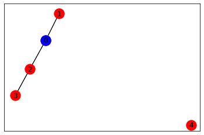
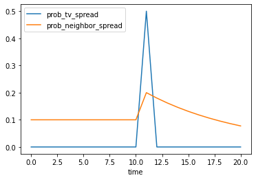
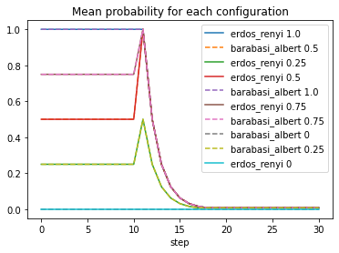
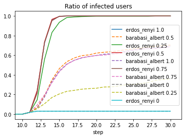

Soil Tutorial
=============

Introduction
------------

This notebook is an introduction to the soil agent-based social network
simulation framework. In particular, we will focus on a specific use
case: studying the propagation of news in a social network.

The steps we will follow are:

-  Modelling the behavior of agents
-  Running the simulation using different configurations
-  Analysing the results of each simulation

But before that, let’s import the soil module and networkx.

.. code:: ipython3

    import soil
    import networkx as nx
     
    %load_ext autoreload
    %autoreload 2
    
    import matplotlib.pyplot as plt

Basic concepts
--------------

There are three main elements in a soil simulation:

-  The environment or model. It assigns agents to nodes in the network,
   and stores the environment parameters (shared state for all agents).
-  The network topology. A simulation may use an existing NetworkX
   topology, or generate one on the fly.
-  Agents. There are several types of agents, depending on their
   behavior and their capabilities. Some examples of built-in types of
   agents are:

   -  Network agents, which are linked to a node in the topology. They
      have additional methods to access their neighbors.
   -  FSM (Finite state machine) agents. Their behavior is defined in
      terms of states, and an agent will move from one state to another.
   -  Evented agents, an actor-based model of agents, which can
      communicate with one another through message passing.
   -  For convenience, a general ``soil.Agent`` class is provided, which
      inherits from Network, FSM and Evented at the same time.

Soil provides several abstractions over events to make developing agents
easier. This means you can use events (timeouts, delays) in soil, but
for the most part we will assume your models will be step-based o.

Modeling behaviour
------------------

Our first step will be to model how every person in the social network
reacts to hearing a piece of disinformation (news). We will follow a
very simple model based on a finite state machine.

A person may be in one of two states: **neutral** (the default state)
and **infected**. A neutral person may hear about a piece of
disinformation either on the TV (with probability **prob_tv_spread**) or
through their friends. Once a person has heard the news, they will
spread it to their friends (with a probability
**prob_neighbor_spread**). Some users do not have a TV, so they will
only be infected by their friends.

The spreading probabilities will change over time due to different
factors. We will represent this variance using an additional agent which
will not be a part of the social network.

Modelling Agents
~~~~~~~~~~~~~~~~

The following sections will cover the basics of developing agents in
SOIL.

For more advanced patterns, please check the **examples** folder in the
repository.

Basic agents
^^^^^^^^^^^^

The most basic agent in Soil is ``soil.BaseAgent``. These agents
implement their behavior by overriding the ``step`` method, which will
be run in every simulation step. Only one agent will be running at any
given time, and it will be doing so until the ``step`` function returns.

Agents can access their environment through their ``self.model``
attribute. This is most commonly used to get access to the environment
parameters and methods. Here is a simple example of an agent:

.. code:: python

   class ExampleAgent(BaseAgent):
       def init(self):
           self.is_infected = False
           self.steps_neutral = 0
       
       def step(self):
           # Implement agent logic
           if self.is_infected:
               ... # Do something, like infecting other agents
               return self.die("No need to do anything else") # Stop forever
           else:
               ... # Do something
               self.steps_neutral += 1
               if self.steps_neutral > self.model.max_steps_neutral:
                   self.is_infected = True

Any kind of agent behavior can be implemented with this ``step``
function. However, it has two main drawbacks: 1) complex behaviors can
get difficult both write and understand; 2) these behaviors are not
composable.

FSM agents
^^^^^^^^^^

One way to solve both issues is to model agents as `Finite-state
Machines <https://en.wikipedia.org/wiki/Finite-state_machine>`__ (FSM,
for short). FSM define a series of possible states for the agent, and
changes between these states. These states can be modelled and extended
independently.

This is modelled in Soil through the ``soil.FSM`` class. Agents that
inherit from ``soil.FSM`` do not need to specify a ``step`` method.
Instead, we describe each finite state with a function. To change to
another state, a function may return the new state, or the ``id`` of a
state. If no state is returned, the state remains unchanged.

The current state of the agent can be checked with ``agent.state_id``.
That state id can be used to look for other agents in that specific
state.

Our previous example could be expressed like this:

.. code:: python

   class FSMExample(FSM):

       def init(self):
           self.steps_neutral = 0
       
       @state(default=True)
       def neutral(self):
           ... # Do something
           self.steps_neutral += 1
           if self.steps_neutral > self.model.max_steps_neutral:
               return self.infected  # Change state

       @state
       def infected(self):
           ... # Do something
           return self.die("No need to do anything else")

Generator-based agents
^^^^^^^^^^^^^^^^^^^^^^

Another design pattern that can be very useful in some cases is to model
each step (or a specific state) using generators (the ``yield``
keyword).

.. code:: python

   class GenExample(BaseAgent):
       def step(self):
           for i in range(self.model.max_steps_neutral):
               ... # Do something
               yield  # Signal the scheduler that this step is done for now
           ... # Do something
           return self.die("No need to do anything else")        

Telling the scheduler when to wake up an agent
^^^^^^^^^^^^^^^^^^^^^^^^^^^^^^^^^^^^^^^^^^^^^^

By default, every agent will be called in every simulation step, and the
time elapsed between two steps is controlled by the ``interval``
attribute in the environment.

But agents may signal the scheduler when they expect to be called again.
This is especially useful when an agent is going to be dormant for a
long time. To do so, an agent can return (or ``yield``) from a ``step``
or a ``state`` a value of type ``soil.When`` (absolute time),
``soil.Delta`` (relative time) or ``soil.Cond``, telling the scheduler
when the agent will be ready to run again. If it returns nothing (i.e.,
``None``), the agent will be ready to run at the next simulation step.

Environment agents
~~~~~~~~~~~~~~~~~~

Environment agents allow us to control the state of the environment. In
this case, we will use an environment agent to simulate a very viral
event.

When the event happens, the agent will modify the probability of
spreading the rumor.

.. code:: ipython3

    import logging
    
    class EventGenerator(soil.BaseAgent):
        level = logging.INFO
        
        def step(self):
            # Do nothing until the time of the event
            yield soil.When(self.model.event_time)
            self.info("TV event happened")
            self.model.prob_tv_spread = 0.5
            self.model.prob_neighbor_spread *= 2
            self.model.prob_neighbor_spread = min(self.model.prob_neighbor_spread, 1)
            yield
            self.model.prob_tv_spread = 0
    
            while self.alive:
                self.model.prob_neighbor_spread = self.model.prob_neighbor_spread * self.model.neighbor_factor
                if self.model.prob_neighbor_spread < 0.01:
                    return self.die("neighbors can no longer spread the rumour")
                yield

Environment (Model)
~~~~~~~~~~~~~~~~~~~

Let’s define a environment model to test our event generator agent. This
environment will have a single agent (the event generator). We will also
tell the environment to save the value of ``prob_tv_spread`` after every
step:

.. code:: ipython3

    class NewsEnv(soil.NetworkEnvironment):
        
        prob_tv_spread = 0.1
        prob_neighbor_spread = 0.1
        event_time = 10
        tv_factor = 0.5
        neighbor_factor = 0.9
    
        
        def init(self):
            self.add_model_reporter("prob_tv_spread")
            self.add_agent(EventGenerator)

Once the environment has been defined, we can run a simulation

.. code:: ipython3

    it = NewsEnv.run(iterations=1, dump=False, max_time=14)
    
    it[0].model_df()

.. parsed-literal::

    HBox(children=(IntProgress(value=0, description='NewsEnv', max=1, style=ProgressStyle(description_width='initi…

.. parsed-literal::

    HBox(children=(IntProgress(value=0, max=1), HTML(value='')))

.. parsed-literal::

    

.. raw:: html

    

    
    <table border="1" class="dataframe">
      <thead>
        <tr style="text-align: right;">
          <th></th>
          <th>step</th>
          <th>agent_count</th>
          <th>prob_tv_spread</th>
        </tr>
        <tr>
          <th>time</th>
          <th></th>
          <th></th>
          <th></th>
        </tr>
      </thead>
      <tbody>
        <tr>
          <th>0</th>
          <td>0</td>
          <td>1</td>
          <td>0.1</td>
        </tr>
        <tr>
          <th>10</th>
          <td>1</td>
          <td>1</td>
          <td>0.1</td>
        </tr>
        <tr>
          <th>11</th>
          <td>2</td>
          <td>1</td>
          <td>0.5</td>
        </tr>
        <tr>
          <th>12</th>
          <td>3</td>
          <td>1</td>
          <td>0.0</td>
        </tr>
        <tr>
          <th>13</th>
          <td>4</td>
          <td>1</td>
          <td>0.0</td>
        </tr>
        <tr>
          <th>14</th>
          <td>5</td>
          <td>1</td>
          <td>0.0</td>
        </tr>
      </tbody>
    </table>
    

As we can see, the event occurred right after ``t=10``, so by ``t=11``
the value of ``prob_tv_spread`` was already set to ``1.0``.

You may notice nothing happened between ``t=0`` and ``t=1``. That is
because there aren’t any other agents in the simulation, and our event
generator explicitly waited until ``t=10``.

Network agents
~~~~~~~~~~~~~~

In our disinformation scenario, we will model our agents as a FSM with
two states: ``neutral`` (default) and ``infected``.

Here’s the code:

.. code:: ipython3

    class NewsSpread(soil.Agent):
        has_tv = False
        infected_by_friends = False
        
        @soil.state(default=True)
        def neutral(self):
            if self.infected_by_friends:
                return self.infected
            if self.has_tv:
                if self.prob(self.model.prob_tv_spread):
                    return self.infected
                
        @soil.state
        def infected(self):
            for neighbor in self.iter_neighbors(state_id=self.neutral.id):
                if self.prob(self.model.prob_neighbor_spread):
                    neighbor.infected_by_friends = True

We can check that our states are well defined, here:

.. code:: ipython3

    NewsSpread.states()

.. parsed-literal::

    ['dead', 'neutral', 'infected']

Environment (Model)
~~~~~~~~~~~~~~~~~~~

Let’s modify our simple simulation. We will add a network of agents of
type NewsSpread.

Only one agent (0) will have a TV (in blue).

.. code:: ipython3

    def generate_simple():
        G = nx.Graph()
        G.add_edge(0, 1)
        G.add_edge(0, 2)
        G.add_edge(2, 3)
        G.add_node(4)
        return G
    
    G = generate_simple()
    pos = nx.spring_layout(G)
    nx.draw_networkx(G, pos, node_color='red')
    nx.draw_networkx(G, pos, nodelist=[0], node_color='blue')

.. code:: ipython3

    class NewsEnv(soil.NetworkEnvironment):
        
        prob_tv_spread = 0
        prob_neighbor_spread = 0.1
        event_time = 10
        tv_factor = 0.5
        neighbor_factor = 0.9
    
        
        def init(self):
            self.add_agent(EventGenerator)
            self.G = generate_simple()
            self.populate_network(NewsSpread)
            self.agent(node_id=0).has_tv = True
            self.add_model_reporter('prob_tv_spread')
            self.add_model_reporter('prob_neighbor_spread')

.. code:: ipython3

    it = NewsEnv.run(max_time=20)
    it[0].model_df()

.. parsed-literal::

    HBox(children=(IntProgress(value=0, description='NewsEnv', max=1, style=ProgressStyle(description_width='initi…

.. parsed-literal::

    HBox(children=(IntProgress(value=0, max=1), HTML(value='')))

.. parsed-literal::

    

.. raw:: html

    

    
    <table border="1" class="dataframe">
      <thead>
        <tr style="text-align: right;">
          <th></th>
          <th>step</th>
          <th>agent_count</th>
          <th>prob_tv_spread</th>
          <th>prob_neighbor_spread</th>
        </tr>
        <tr>
          <th>time</th>
          <th></th>
          <th></th>
          <th></th>
          <th></th>
        </tr>
      </thead>
      <tbody>
        <tr>
          <th>0</th>
          <td>0</td>
          <td>6</td>
          <td>0.0</td>
          <td>0.100000</td>
        </tr>
        <tr>
          <th>1</th>
          <td>1</td>
          <td>6</td>
          <td>0.0</td>
          <td>0.100000</td>
        </tr>
        <tr>
          <th>2</th>
          <td>2</td>
          <td>6</td>
          <td>0.0</td>
          <td>0.100000</td>
        </tr>
        <tr>
          <th>3</th>
          <td>3</td>
          <td>6</td>
          <td>0.0</td>
          <td>0.100000</td>
        </tr>
        <tr>
          <th>4</th>
          <td>4</td>
          <td>6</td>
          <td>0.0</td>
          <td>0.100000</td>
        </tr>
        <tr>
          <th>5</th>
          <td>5</td>
          <td>6</td>
          <td>0.0</td>
          <td>0.100000</td>
        </tr>
        <tr>
          <th>6</th>
          <td>6</td>
          <td>6</td>
          <td>0.0</td>
          <td>0.100000</td>
        </tr>
        <tr>
          <th>7</th>
          <td>7</td>
          <td>6</td>
          <td>0.0</td>
          <td>0.100000</td>
        </tr>
        <tr>
          <th>8</th>
          <td>8</td>
          <td>6</td>
          <td>0.0</td>
          <td>0.100000</td>
        </tr>
        <tr>
          <th>9</th>
          <td>9</td>
          <td>6</td>
          <td>0.0</td>
          <td>0.100000</td>
        </tr>
        <tr>
          <th>10</th>
          <td>10</td>
          <td>6</td>
          <td>0.0</td>
          <td>0.100000</td>
        </tr>
        <tr>
          <th>11</th>
          <td>11</td>
          <td>6</td>
          <td>0.5</td>
          <td>0.200000</td>
        </tr>
        <tr>
          <th>12</th>
          <td>12</td>
          <td>6</td>
          <td>0.0</td>
          <td>0.180000</td>
        </tr>
        <tr>
          <th>13</th>
          <td>13</td>
          <td>6</td>
          <td>0.0</td>
          <td>0.162000</td>
        </tr>
        <tr>
          <th>14</th>
          <td>14</td>
          <td>6</td>
          <td>0.0</td>
          <td>0.145800</td>
        </tr>
        <tr>
          <th>15</th>
          <td>15</td>
          <td>6</td>
          <td>0.0</td>
          <td>0.131220</td>
        </tr>
        <tr>
          <th>16</th>
          <td>16</td>
          <td>6</td>
          <td>0.0</td>
          <td>0.118098</td>
        </tr>
        <tr>
          <th>17</th>
          <td>17</td>
          <td>6</td>
          <td>0.0</td>
          <td>0.106288</td>
        </tr>
        <tr>
          <th>18</th>
          <td>18</td>
          <td>6</td>
          <td>0.0</td>
          <td>0.095659</td>
        </tr>
        <tr>
          <th>19</th>
          <td>19</td>
          <td>6</td>
          <td>0.0</td>
          <td>0.086093</td>
        </tr>
        <tr>
          <th>20</th>
          <td>20</td>
          <td>6</td>
          <td>0.0</td>
          <td>0.077484</td>
        </tr>
      </tbody>
    </table>
    

In this case, notice that the inclusion of other agents (which run every
step) means that the simulation did not skip to ``t=10``.

Now, let’s look at the state of our agents in every step:

.. code:: ipython3

    soil.analysis.plot(it[0])

Running in more scenarios
-------------------------

In real life, you probably want to run several simulations, varying some
of the parameters so that you can compare and answer your research
questions.

For instance:

-  Does the outcome depend on the structure of our network? We will use
   different generation algorithms to compare them (Barabasi-Albert and
   Erdos-Renyi)
-  How does neighbor spreading probability affect my simulation? We will
   try probability values in the range of [0, 0.4], in intervals of 0.1.

.. code:: ipython3

    class NewsEnvComplete(soil.Environment):
        prob_tv = 0.05
        prob_tv_spread = 0
        prob_neighbor_spread = 0
        event_time = 10
        tv_factor = 0
        neighbor_factor = 0.5
        generator = "erdos_renyi_graph"
        n = 100
    
        def init(self):
            self.add_agent(EventGenerator)
            if not self.G:
                opts = {"n": self.n}
                if self.generator == "erdos_renyi_graph":
                    opts["p"] = 0.5
                elif self.generator == "barabasi_albert_graph":
                    opts["m"] = 4
                self.create_network(generator=self.generator, **opts)
    
            self.populate_network([NewsSpread,
                                   NewsSpread.w(has_tv=True)],
                                  [1-self.prob_tv, self.prob_tv])
            self.add_model_reporter('prob_tv_spread')
            self.add_model_reporter('prob_neighbor_spread')
            self.add_agent_reporter('state_id')

Since we do not care about previous results, we will
set\ ``overwrite=True``.

.. code:: ipython3

    s = soil.Simulation(model=NewsEnvComplete, iterations=5, max_time=30, dump=True, overwrite=True)
    N = 100
    probabilities = [0, 0.25, 0.5, 0.75, 1.0]
    generators = ["erdos_renyi_graph", "barabasi_albert_graph"]
    
    
    it = s.run(name=f"newspread", matrix=dict(n=[N], generator=generators, prob_neighbor_spread=probabilities))

.. parsed-literal::

    [INFO ][17:29:24] Output directory: /mnt/data/home/j/git/lab.gsi/soil/soil/examples/tutorial/soil_output

.. parsed-literal::

    HBox(children=(IntProgress(value=0, description='newspread', max=10, style=ProgressStyle(description_width='in…

.. parsed-literal::

    n = 100
    generator = erdos_renyi_graph
    prob_neighbor_spread = 0

.. parsed-literal::

    HBox(children=(IntProgress(value=0, max=5), HTML(value='')))

.. parsed-literal::

    n = 100
    generator = erdos_renyi_graph
    prob_neighbor_spread = 0.25

.. parsed-literal::

    HBox(children=(IntProgress(value=0, max=5), HTML(value='')))

.. parsed-literal::

    n = 100
    generator = erdos_renyi_graph
    prob_neighbor_spread = 0.5

.. parsed-literal::

    HBox(children=(IntProgress(value=0, max=5), HTML(value='')))

.. parsed-literal::

    n = 100
    generator = erdos_renyi_graph
    prob_neighbor_spread = 0.75

.. parsed-literal::

    HBox(children=(IntProgress(value=0, max=5), HTML(value='')))

.. parsed-literal::

    n = 100
    generator = erdos_renyi_graph
    prob_neighbor_spread = 1.0

.. parsed-literal::

    HBox(children=(IntProgress(value=0, max=5), HTML(value='')))

.. parsed-literal::

    n = 100
    generator = barabasi_albert_graph
    prob_neighbor_spread = 0

.. parsed-literal::

    HBox(children=(IntProgress(value=0, max=5), HTML(value='')))

.. parsed-literal::

    n = 100
    generator = barabasi_albert_graph
    prob_neighbor_spread = 0.25

.. parsed-literal::

    HBox(children=(IntProgress(value=0, max=5), HTML(value='')))

.. parsed-literal::

    n = 100
    generator = barabasi_albert_graph
    prob_neighbor_spread = 0.5

.. parsed-literal::

    HBox(children=(IntProgress(value=0, max=5), HTML(value='')))

.. parsed-literal::

    n = 100
    generator = barabasi_albert_graph
    prob_neighbor_spread = 0.75

.. parsed-literal::

    HBox(children=(IntProgress(value=0, max=5), HTML(value='')))

.. parsed-literal::

    n = 100
    generator = barabasi_albert_graph
    prob_neighbor_spread = 1.0

.. parsed-literal::

    HBox(children=(IntProgress(value=0, max=5), HTML(value='')))

.. parsed-literal::

    

.. code:: ipython3

    assert len(it) == len(probabilities) * len(generators) * s.iterations

The results are conveniently stored in sqlite (history of agent and
environment state) and the configuration is saved in a YAML file.

You can also export the results to GEXF format (dynamic network) and CSV
using .\ ``run(dump=['gexf', 'csv'])`` or the command line flags
``--graph --csv``.

.. code:: ipython3

    !tree soil_output
    !du -xh soil_output/*

.. parsed-literal::

    soil_output
    └── newspread
        ├── newspread_1681989837.124865.dumped.yml
        ├── newspread_1681990513.1584163.dumped.yml
        ├── newspread_1681990524.5204282.dumped.yml
        ├── newspread_1681990796.858183.dumped.yml
        ├── newspread_1682002299.544348.dumped.yml
        ├── newspread_1682003721.597205.dumped.yml
        ├── newspread_1682003784.1948986.dumped.yml
        ├── newspread_1682003812.4626257.dumped.yml
        ├── newspread_1682004020.182087.dumped.yml
        ├── newspread_1682004044.6837814.dumped.yml
        ├── newspread_1682004398.267355.dumped.yml
        ├── newspread_1682004564.1052232.dumped.yml
        └── newspread.sqlite
    
    1 directory, 13 files
    21M	soil_output/newspread

Analysing the results
~~~~~~~~~~~~~~~~~~~~~

Loading data
^^^^^^^^^^^^

Once the simulations are over, we can use soil to analyse the results.

There are two main ways: directly using the iterations returned by the
``run`` method, or loading up data from the results database. This is
particularly useful to store data between sessions, and to accumulate
results over multiple runs.

The mainThe main method to load data from the database is ``read_sql``,
which can be used in two ways:

-  ``analysis.read_sql(<sqlite_file>)`` to load all the results from a
   sqlite database . e.g. \ ``read_sql('my_simulation/file.db.sqlite')``
-  ``analysis.read_sql(name=<simulation name>)`` will look for the
   default path for a simulation named ``<simulation name>``

The result in both cases is a named tuple with four dataframes:

-  ``configuration``, which contains configuration parameters per
   simulation
-  ``parameters``, which shows the parameters used **in every
   iteration** of every simulation
-  ``env``, with the data collected from the model in each iteration (as
   specified in ``model_reporters``)
-  ``agents``, like ``env``, but for ``agent_reporters``

Let’s see it in action by loading the stored results into a pandas
dataframe:

.. code:: ipython3

    res = soil.read_sql(name="newspread", include_agents=True)

Plotting data
~~~~~~~~~~~~~

Once we have loaded the results from the file, we can use them just like
any other dataframe.

Here is an example of plotting the ratio of infected users in each of
our simulations:

.. code:: ipython3

    for (g, group) in res.env.dropna().groupby("params_id"):
        params = res.parameters.query(f'params_id == "{g}"').iloc[0]
        title = f"{params.generator.rstrip('_graph')} {params.prob_neighbor_spread}"
        prob = group.groupby(by=["step"]).prob_neighbor_spread.mean()
        line = "-"
        if "barabasi" in params.generator:
            line = "--"
        prob.rename(title).fillna(0).plot(linestyle=line)
    plt.title("Mean probability for each configuration")
    plt.legend();

.. code:: ipython3

    for (g, group) in res.agents.dropna().groupby("params_id"):
        params = res.parameters.query(f'params_id == "{g}"').iloc[0]
        title = f"{params.generator.rstrip('_graph')} {params.prob_neighbor_spread}"
        counts = group.groupby(by=["step", "state_id"]).value_counts().unstack()
        line = "-"
        if "barabasi" in params.generator:
            line = "--"
        (counts.infected/counts.sum(axis=1)).rename(title).fillna(0).plot(linestyle=line)
    plt.legend()
    plt.xlim([9, None]);
    plt.title("Ratio of infected users");

Data format
-----------

Parameters
~~~~~~~~~~

The ``parameters`` dataframe has three keys:

-  The identifier of the simulation. This will be shared by all
   iterations launched in the same run
-  The identifier of the parameters used in the simulation. This will be
   shared by all iterations that have the exact same set of parameters.
-  The identifier of the iteration. Each row should have a different
   iteration identifier

There will be a column per each parameter passed to the environment. In
this case, that’s three: **generator**, **n** and
**prob_neighbor_spread**.

.. code:: ipython3

    res.parameters.head()

.. raw:: html

    

    
    <table border="1" class="dataframe">
      <thead>
        <tr style="text-align: right;">
          <th></th>
          <th></th>
          <th>key</th>
          <th>generator</th>
          <th>n</th>
          <th>prob_neighbor_spread</th>
        </tr>
        <tr>
          <th>iteration_id</th>
          <th>params_id</th>
          <th>simulation_id</th>
          <th></th>
          <th></th>
          <th></th>
        </tr>
      </thead>
      <tbody>
        <tr>
          <th rowspan="5" valign="top">0</th>
          <th>39063f8</th>
          <th>newspread_1682002299.544348</th>
          <td>erdos_renyi_graph</td>
          <td>100</td>
          <td>1.0</td>
        </tr>
        <tr>
          <th>5db645d</th>
          <th>newspread_1682002299.544348</th>
          <td>barabasi_albert_graph</td>
          <td>100</td>
          <td>0.0</td>
        </tr>
        <tr>
          <th>8f26adb</th>
          <th>newspread_1682002299.544348</th>
          <td>barabasi_albert_graph</td>
          <td>100</td>
          <td>0.5</td>
        </tr>
        <tr>
          <th>cb3dbca</th>
          <th>newspread_1682002299.544348</th>
          <td>erdos_renyi_graph</td>
          <td>100</td>
          <td>0.5</td>
        </tr>
        <tr>
          <th>d1fe9c1</th>
          <th>newspread_1682002299.544348</th>
          <td>barabasi_albert_graph</td>
          <td>100</td>
          <td>1.0</td>
        </tr>
      </tbody>
    </table>
    

Configuration
~~~~~~~~~~~~~

This dataset is indexed by the identifier of the simulation, and there
will be a column per each attribute of the simulation. For instance,
there is one for the number of processes used, another one for the path
where the results were stored, etc.

.. code:: ipython3

    res.config.head()

.. raw:: html

    

    
    <table border="1" class="dataframe">
      <thead>
        <tr style="text-align: right;">
          <th></th>
          <th>index</th>
          <th>version</th>
          <th>source_file</th>
          <th>name</th>
          <th>description</th>
          <th>group</th>
          <th>backup</th>
          <th>overwrite</th>
          <th>dry_run</th>
          <th>dump</th>
          <th>...</th>
          <th>num_processes</th>
          <th>exporters</th>
          <th>model_reporters</th>
          <th>agent_reporters</th>
          <th>tables</th>
          <th>outdir</th>
          <th>exporter_params</th>
          <th>level</th>
          <th>skip_test</th>
          <th>debug</th>
        </tr>
        <tr>
          <th>simulation_id</th>
          <th></th>
          <th></th>
          <th></th>
          <th></th>
          <th></th>
          <th></th>
          <th></th>
          <th></th>
          <th></th>
          <th></th>
          <th></th>
          <th></th>
          <th></th>
          <th></th>
          <th></th>
          <th></th>
          <th></th>
          <th></th>
          <th></th>
          <th></th>
          <th></th>
        </tr>
      </thead>
      <tbody>
        <tr>
          <th>newspread_1682002299.544348</th>
          <td>0</td>
          <td>2</td>
          <td>None</td>
          <td>newspread</td>
          <td></td>
          <td>None</td>
          <td>False</td>
          <td>True</td>
          <td>False</td>
          <td>True</td>
          <td>...</td>
          <td>1</td>
          <td>[&lt;class 'soil.exporters.default'&gt;]</td>
          <td>{}</td>
          <td>{}</td>
          <td>{}</td>
          <td>/mnt/data/home/j/git/lab.gsi/soil/soil/example...</td>
          <td>{}</td>
          <td>20</td>
          <td>False</td>
          <td>False</td>
        </tr>
      </tbody>
    </table>
    
1 rows × 29 columns

    

Model reporters
~~~~~~~~~~~~~~~

The ``env`` dataframe includes the data collected from the model. The
keys in this case are the same as ``parameters``, and an additional one:
**step**.

.. code:: ipython3

    res.env.head()

.. raw:: html

    

    
    <table border="1" class="dataframe">
      <thead>
        <tr style="text-align: right;">
          <th></th>
          <th></th>
          <th></th>
          <th></th>
          <th>agent_count</th>
          <th>time</th>
          <th>prob_tv_spread</th>
          <th>prob_neighbor_spread</th>
        </tr>
        <tr>
          <th>simulation_id</th>
          <th>params_id</th>
          <th>iteration_id</th>
          <th>step</th>
          <th></th>
          <th></th>
          <th></th>
          <th></th>
        </tr>
      </thead>
      <tbody>
        <tr>
          <th rowspan="5" valign="top">newspread_1682002299.544348</th>
          <th rowspan="5" valign="top">fcfc955</th>
          <th rowspan="5" valign="top">0</th>
          <th>0</th>
          <td>101</td>
          <td>0</td>
          <td>0.0</td>
          <td>0.0</td>
        </tr>
        <tr>
          <th>1</th>
          <td>101</td>
          <td>1</td>
          <td>0.0</td>
          <td>0.0</td>
        </tr>
        <tr>
          <th>2</th>
          <td>101</td>
          <td>2</td>
          <td>0.0</td>
          <td>0.0</td>
        </tr>
        <tr>
          <th>3</th>
          <td>101</td>
          <td>3</td>
          <td>0.0</td>
          <td>0.0</td>
        </tr>
        <tr>
          <th>4</th>
          <td>101</td>
          <td>4</td>
          <td>0.0</td>
          <td>0.0</td>
        </tr>
      </tbody>
    </table>
    

Agent reporters
~~~~~~~~~~~~~~~

This dataframe reflects the data collected for all the agents in the
simulation, in every step where data collection was invoked.

The key in this dataframe is similar to the one in the ``parameters``
dataframe, but there will be two more keys: the ``step`` and the
``agent_id``. There will be a column per each agent reporter added to
the model. In our case, there is only one: ``state_id``.

.. code:: ipython3

    res.agents.head()

.. raw:: html

    

    
    <table border="1" class="dataframe">
      <thead>
        <tr style="text-align: right;">
          <th></th>
          <th></th>
          <th></th>
          <th></th>
          <th></th>
          <th>state_id</th>
        </tr>
        <tr>
          <th>simulation_id</th>
          <th>params_id</th>
          <th>iteration_id</th>
          <th>step</th>
          <th>agent_id</th>
          <th></th>
        </tr>
      </thead>
      <tbody>
        <tr>
          <th rowspan="5" valign="top">newspread_1682002299.544348</th>
          <th rowspan="5" valign="top">fcfc955</th>
          <th rowspan="5" valign="top">0</th>
          <th rowspan="5" valign="top">0</th>
          <th>0</th>
          <td>None</td>
        </tr>
        <tr>
          <th>1</th>
          <td>neutral</td>
        </tr>
        <tr>
          <th>2</th>
          <td>neutral</td>
        </tr>
        <tr>
          <th>3</th>
          <td>neutral</td>
        </tr>
        <tr>
          <th>4</th>
          <td>neutral</td>
        </tr>
      </tbody>
    </table>
    

