Soil Tutorial
=============

Introduction
------------

This notebook is an introduction to the soil agent-based social network
simulation framework. In particular, we will focus on a specific use
case: studying the propagation of news in a social network.

The steps we will follow are:

-  Modelling the behavior of agents
-  Running the simulation using different configurations
-  Analysing the results of each simulation

But before that, let's import the soil module and networkx.

.. code:: ipython3

    import soil
    import networkx as nx
     
    %load_ext autoreload
    %autoreload 2
    
    %pylab inline
    # To display plots in the notebook_

.. parsed-literal::

    Populating the interactive namespace from numpy and matplotlib

Basic concepts
--------------

There are three main elements in a soil simulation:

-  The network topology. A simulation may use an existing NetworkX
   topology, or generate one on the fly
-  Agents. There are two types: 1) network agents, which are linked to a
   node in the topology, and 2) environment agents, which are freely
   assigned to the environment.
-  The environment. It assigns agents to nodes in the network, and
   stores the environment parameters (shared state for all agents).

Modeling behaviour
------------------

Our first step will be to model how every person in the social network
reacts when it comes to news. We will follow a very simple model (a
finite state machine).

There are two types of people, those who have heard about a newsworthy
event (infected) or those who have not (neutral). A neutral person may
heard about the news either on the TV (with probability
**prob\_tv\_spread**) or through their friends. Once a person has heard
the news, they will spread it to their friends (with a probability
**prob\_neighbor\_spread**). Some users do not have a TV, so they only
rely on their friends.

The spreading probabilities will change over time due to different
factors. We will represent this variance using an environment agent.

Network Agents
~~~~~~~~~~~~~~

A basic network agent in Soil should inherit from
``soil.agents.BaseAgent``, and define its behaviour in every step of the
simulation by implementing a ``run(self)`` method. The most important
attributes of the agent are:

-  ``agent.state``, a dictionary with the state of the agent.
   ``agent.state['id']`` reflects the state id of the agent. That state
   id can be used to look for other networks in that specific state. The
   state can be access via the agent as well. For instance:

   .. code:: py

       a = soil.agents.BaseAgent(env=env)
       a['hours_of_sleep'] = 10
       print(a['hours_of_sleep'])

   The state of the agent is stored in every step of the simulation:
   ``py   print(a['hours_of_sleep', 10]) # hours of sleep before step #10   print(a[None, 0]) # whole state of the agent before step #0``

-  ``agent.env``, a reference to the environment. Most commonly used to
   get access to the environment parameters and the topology:

   .. code:: py

       a.env.G.nodes() # Get all nodes ids in the topology
       a.env['minimum_hours_of_sleep']

Since our model is a finite state machine, we will be basing it on
``soil.agents.FSM``.

With ``soil.agents.FSM``, we do not need to specify a ``step`` method.
Instead, we describe every step as a function. To change to another
state, a function may return the new state. If no state is returned, the
state remains unchanged.[ It will consist of two states, ``neutral``
(default) and ``infected``.

Here's the code:

.. code:: ipython3

    import random
    
    class NewsSpread(soil.agents.FSM):
        @soil.agents.default_state
        @soil.agents.state
        def neutral(self):
            r = random.random()
            if self['has_tv'] and r < self.model['prob_tv_spread']:
                    return self.infected
            return
        
        @soil.agents.state
        def infected(self):
            prob_infect = self.model['prob_neighbor_spread']
            for neighbor in self.get_neighboring_agents(state_id=self.neutral.id):
                r = random.random()
                if r < prob_infect:
                    neighbor.state['id'] = self.infected.id
            return
            

Environment agents
~~~~~~~~~~~~~~~~~~

Environment agents allow us to control the state of the environment. In
this case, we will use an environment agent to simulate a very viral
event.

When the event happens, the agent will modify the probability of
spreading the rumor.

.. code:: ipython3

    NEIGHBOR_FACTOR = 0.9
    TV_FACTOR = 0.5
    class NewsEnvironmentAgent(soil.agents.BaseAgent):
        def step(self):
            if self.now == self['event_time']:
                self.model['prob_tv_spread'] = 1
                self.model['prob_neighbor_spread'] = 1
            elif self.now > self['event_time']:
                self.model['prob_tv_spread'] = self.model['prob_tv_spread'] * TV_FACTOR
                self.model['prob_neighbor_spread'] = self.model['prob_neighbor_spread'] * NEIGHBOR_FACTOR

Testing the agents
~~~~~~~~~~~~~~~~~~

Feel free to skip this section if this is your first time with soil.

Testing agents is not easy, and this is not a thorough testing process
for agents. Rather, this section is aimed to show you how to access
internal pats of soil so you can test your agents.

First of all, let's check if our network agent has the states we would
expect:

.. code:: ipython3

    NewsSpread.states

.. parsed-literal::

    {'infected': <function __main__.NewsSpread.infected>,
     'neutral': <function __main__.NewsSpread.neutral>}

Now, let's run a simulation on a simple network. It is comprised of
three nodes:

.. code:: ipython3

    G = nx.Graph()
    G.add_edge(0, 1)
    G.add_edge(0, 2)
    G.add_edge(2, 3)
    G.add_node(4)
    pos = nx.spring_layout(G)
    nx.draw_networkx(G, pos, node_color='red')
    nx.draw_networkx(G, pos, nodelist=[0], node_color='blue')

.. image:: output_21_0.png

Let's run a simple simulation that assigns a NewsSpread agent to all the
nodes in that network. Notice how node 0 is the only one with a TV.

.. code:: ipython3

    env_params = {'prob_tv_spread': 0,
                 'prob_neighbor_spread': 0}
    
    MAX_TIME = 100
    EVENT_TIME = 10
    
    sim = soil.Simulation(topology=G,
                                         num_trials=1,
                                         max_time=MAX_TIME,
                                         environment_agents=[{'agent_class': NewsEnvironmentAgent,
                                                             'state': {
                                                                 'event_time': EVENT_TIME
                                                             }}],
                                         network_agents=[{'agent_class': NewsSpread,
                                                          'weight': 1}],
                                         states={0: {'has_tv': True}},
                                         default_state={'has_tv': False},
                                         environment_params=env_params)
    env = sim.run_simulation()[0]

.. parsed-literal::

    INFO:soil.utils:Trial: 0
    INFO:soil.utils:	Running
    INFO:soil.utils:Finished trial in 0.02695441246032715 seconds
    INFO:soil.utils:NOT dumping results
    INFO:soil.utils:Finished simulation in 0.03360605239868164 seconds

Now we can access the results of the simulation and compare them to our
expected results

.. code:: ipython3

    agents = list(env.network_agents)
    
    # Until the event, all agents are neutral
    for t in range(10):
        for a in agents:
            assert a['id', t] == a.neutral.id
    
    # After the event, the node with a TV is infected, the rest are not
    assert agents[0]['id', 11] == NewsSpread.infected.id
    
    for a in agents[1:4]:
        assert a['id', 11] == NewsSpread.neutral.id
    
    # At the end, the agents connected to the infected one will probably be infected, too.
    assert agents[1]['id', MAX_TIME] == NewsSpread.infected.id
    assert agents[2]['id', MAX_TIME] == NewsSpread.infected.id
    
    # But the node with no friends should not be affected
    assert agents[4]['id', MAX_TIME] == NewsSpread.neutral.id
            

Lastly, let's see if the probabilities have decreased as expected:

.. code:: ipython3

    assert abs(env.environment_params['prob_neighbor_spread'] - (NEIGHBOR_FACTOR**(MAX_TIME-1-10))) < 10e-4
    assert abs(env.environment_params['prob_tv_spread'] - (TV_FACTOR**(MAX_TIME-1-10))) < 10e-6

Running the simulation
----------------------

To run a simulation, we need a configuration. Soil can load
configurations from python dictionaries as well as JSON and YAML files.
For this demo, we will use a python dictionary:

.. code:: ipython3

    config = {
        'name': 'ExampleSimulation',
        'max_time': 20,
        'interval': 1,
        'num_trials': 1,
        'network_params': {
           'generator': 'complete_graph',
            'n': 500,
        },
        'network_agents': [
            {
                'agent_class': NewsSpread,
                'weight': 1,
                'state': {
                    'has_tv': False
                }
            },
            {
                'agent_class': NewsSpread,
                'weight': 2,
                'state': {
                    'has_tv': True
                }
            }
        ],
        'environment_agents':[
            {'agent_class': NewsEnvironmentAgent,
             'state': {
                 'event_time': 10
             }
            }
        ],
        'states': [ {'has_tv': True} ],
        'environment_params':{
            'prob_tv_spread': 0.01,
            'prob_neighbor_spread': 0.5
        }
    }

Let's run our simulation:

.. code:: ipython3

    soil.simulation.run_from_config(config)

.. parsed-literal::

    INFO:soil.utils:Using config(s): ExampleSimulation
    INFO:soil.utils:Dumping results to soil_output/ExampleSimulation : False
    INFO:soil.utils:Trial: 0
    INFO:soil.utils:	Running
    INFO:soil.utils:Finished trial in 5.869051456451416 seconds
    INFO:soil.utils:NOT dumping results
    INFO:soil.utils:Finished simulation in 6.9609293937683105 seconds

In real life, you probably want to run several simulations, varying some
of the parameters so that you can compare and answer your research
questions.

For instance:

-  Does the outcome depend on the structure of our network? We will use
   different generation algorithms to compare them (Barabasi-Albert and
   Erdos-Renyi)
-  How does neighbor spreading probability affect my simulation? We will
   try probability values in the range of [0, 0.4], in intervals of 0.1.

.. code:: ipython3

    network_1 = {
           'generator': 'erdos_renyi_graph',
            'n': 500,
            'p': 0.1
    }
    network_2 = {
           'generator': 'barabasi_albert_graph',
            'n': 500,
            'm': 2
    }
    
    
    for net in [network_1, network_2]:
        for i in range(5):
            prob = i / 10
            config['environment_params']['prob_neighbor_spread'] = prob
            config['network_params'] = net
            config['name'] = 'Spread_{}_prob_{}'.format(net['generator'], prob)
            s = soil.simulation.run_from_config(config)

.. parsed-literal::

    INFO:soil.utils:Using config(s): Spread_erdos_renyi_graph_prob_0.0
    INFO:soil.utils:Dumping results to soil_output/Spread_erdos_renyi_graph_prob_0.0 : True
    INFO:soil.utils:Trial: 0
    INFO:soil.utils:	Running
    INFO:soil.utils:Finished trial in 1.2258412837982178 seconds
    INFO:soil.utils:Dumping results to soil_output/Spread_erdos_renyi_graph_prob_0.0
    INFO:soil.utils:Finished simulation in 5.597268104553223 seconds
    INFO:soil.utils:Using config(s): Spread_erdos_renyi_graph_prob_0.1
    INFO:soil.utils:Dumping results to soil_output/Spread_erdos_renyi_graph_prob_0.1 : True
    INFO:soil.utils:Trial: 0
    INFO:soil.utils:	Running
    INFO:soil.utils:Finished trial in 1.3026399612426758 seconds
    INFO:soil.utils:Dumping results to soil_output/Spread_erdos_renyi_graph_prob_0.1
    INFO:soil.utils:Finished simulation in 5.534018278121948 seconds
    INFO:soil.utils:Using config(s): Spread_erdos_renyi_graph_prob_0.2
    INFO:soil.utils:Dumping results to soil_output/Spread_erdos_renyi_graph_prob_0.2 : True
    INFO:soil.utils:Trial: 0
    INFO:soil.utils:	Running
    INFO:soil.utils:Finished trial in 1.4764575958251953 seconds
    INFO:soil.utils:Dumping results to soil_output/Spread_erdos_renyi_graph_prob_0.2
    INFO:soil.utils:Finished simulation in 6.170421123504639 seconds
    INFO:soil.utils:Using config(s): Spread_erdos_renyi_graph_prob_0.3
    INFO:soil.utils:Dumping results to soil_output/Spread_erdos_renyi_graph_prob_0.3 : True
    INFO:soil.utils:Trial: 0
    INFO:soil.utils:	Running
    INFO:soil.utils:Finished trial in 1.5429913997650146 seconds
    INFO:soil.utils:Dumping results to soil_output/Spread_erdos_renyi_graph_prob_0.3
    INFO:soil.utils:Finished simulation in 5.936013221740723 seconds
    INFO:soil.utils:Using config(s): Spread_erdos_renyi_graph_prob_0.4
    INFO:soil.utils:Dumping results to soil_output/Spread_erdos_renyi_graph_prob_0.4 : True
    INFO:soil.utils:Trial: 0
    INFO:soil.utils:	Running
    INFO:soil.utils:Finished trial in 1.4097135066986084 seconds
    INFO:soil.utils:Dumping results to soil_output/Spread_erdos_renyi_graph_prob_0.4
    INFO:soil.utils:Finished simulation in 5.732810974121094 seconds
    INFO:soil.utils:Using config(s): Spread_barabasi_albert_graph_prob_0.0
    INFO:soil.utils:Dumping results to soil_output/Spread_barabasi_albert_graph_prob_0.0 : True
    INFO:soil.utils:Trial: 0
    INFO:soil.utils:	Running
    INFO:soil.utils:Finished trial in 0.751497745513916 seconds
    INFO:soil.utils:Dumping results to soil_output/Spread_barabasi_albert_graph_prob_0.0
    INFO:soil.utils:Finished simulation in 2.3415369987487793 seconds
    INFO:soil.utils:Using config(s): Spread_barabasi_albert_graph_prob_0.1
    INFO:soil.utils:Dumping results to soil_output/Spread_barabasi_albert_graph_prob_0.1 : True
    INFO:soil.utils:Trial: 0
    INFO:soil.utils:	Running
    INFO:soil.utils:Finished trial in 0.8503265380859375 seconds
    INFO:soil.utils:Dumping results to soil_output/Spread_barabasi_albert_graph_prob_0.1
    INFO:soil.utils:Finished simulation in 2.5671920776367188 seconds
    INFO:soil.utils:Using config(s): Spread_barabasi_albert_graph_prob_0.2
    INFO:soil.utils:Dumping results to soil_output/Spread_barabasi_albert_graph_prob_0.2 : True
    INFO:soil.utils:Trial: 0
    INFO:soil.utils:	Running
    INFO:soil.utils:Finished trial in 0.8511502742767334 seconds
    INFO:soil.utils:Dumping results to soil_output/Spread_barabasi_albert_graph_prob_0.2
    INFO:soil.utils:Finished simulation in 2.55816912651062 seconds
    INFO:soil.utils:Using config(s): Spread_barabasi_albert_graph_prob_0.3
    INFO:soil.utils:Dumping results to soil_output/Spread_barabasi_albert_graph_prob_0.3 : True
    INFO:soil.utils:Trial: 0
    INFO:soil.utils:	Running
    INFO:soil.utils:Finished trial in 0.8982968330383301 seconds
    INFO:soil.utils:Dumping results to soil_output/Spread_barabasi_albert_graph_prob_0.3
    INFO:soil.utils:Finished simulation in 2.6871559619903564 seconds
    INFO:soil.utils:Using config(s): Spread_barabasi_albert_graph_prob_0.4
    INFO:soil.utils:Dumping results to soil_output/Spread_barabasi_albert_graph_prob_0.4 : True
    INFO:soil.utils:Trial: 0
    INFO:soil.utils:	Running
    INFO:soil.utils:Finished trial in 0.9563727378845215 seconds
    INFO:soil.utils:Dumping results to soil_output/Spread_barabasi_albert_graph_prob_0.4
    INFO:soil.utils:Finished simulation in 2.5253307819366455 seconds

The results are conveniently stored in pickle (simulation), csv and
sqlite (history of agent and environment state) and gexf (dynamic
network) format.

.. code:: ipython3

    !tree soil_output
    !du -xh soil_output/*

.. parsed-literal::

    soil_output
    ├── Spread_barabasi_albert_graph_prob_0.0
    │   ├── Spread_barabasi_albert_graph_prob_0.0.dumped.yml
    │   ├── Spread_barabasi_albert_graph_prob_0.0.simulation.pickle
    │   ├── Spread_barabasi_albert_graph_prob_0.0_trial_0.backup1508409808.7944386.sqlite
    │   ├── Spread_barabasi_albert_graph_prob_0.0_trial_0.backup1508428617.9811945.sqlite
    │   ├── Spread_barabasi_albert_graph_prob_0.0_trial_0.db.sqlite
    │   ├── Spread_barabasi_albert_graph_prob_0.0_trial_0.environment.csv
    │   └── Spread_barabasi_albert_graph_prob_0.0_trial_0.gexf
    ├── Spread_barabasi_albert_graph_prob_0.1
    │   ├── Spread_barabasi_albert_graph_prob_0.1.dumped.yml
    │   ├── Spread_barabasi_albert_graph_prob_0.1.simulation.pickle
    │   ├── Spread_barabasi_albert_graph_prob_0.1_trial_0.backup1508409810.9913027.sqlite
    │   ├── Spread_barabasi_albert_graph_prob_0.1_trial_0.backup1508428620.3419535.sqlite
    │   ├── Spread_barabasi_albert_graph_prob_0.1_trial_0.db.sqlite
    │   ├── Spread_barabasi_albert_graph_prob_0.1_trial_0.environment.csv
    │   └── Spread_barabasi_albert_graph_prob_0.1_trial_0.gexf
    ├── Spread_barabasi_albert_graph_prob_0.2
    │   ├── Spread_barabasi_albert_graph_prob_0.2.dumped.yml
    │   ├── Spread_barabasi_albert_graph_prob_0.2.simulation.pickle
    │   ├── Spread_barabasi_albert_graph_prob_0.2_trial_0.backup1508409813.2012305.sqlite
    │   ├── Spread_barabasi_albert_graph_prob_0.2_trial_0.backup1508428622.91827.sqlite
    │   ├── Spread_barabasi_albert_graph_prob_0.2_trial_0.db.sqlite
    │   ├── Spread_barabasi_albert_graph_prob_0.2_trial_0.environment.csv
    │   └── Spread_barabasi_albert_graph_prob_0.2_trial_0.gexf
    ├── Spread_barabasi_albert_graph_prob_0.3
    │   ├── Spread_barabasi_albert_graph_prob_0.3.dumped.yml
    │   ├── Spread_barabasi_albert_graph_prob_0.3.simulation.pickle
    │   ├── Spread_barabasi_albert_graph_prob_0.3_trial_0.backup1508409815.5177016.sqlite
    │   ├── Spread_barabasi_albert_graph_prob_0.3_trial_0.backup1508428625.5117545.sqlite
    │   ├── Spread_barabasi_albert_graph_prob_0.3_trial_0.db.sqlite
    │   ├── Spread_barabasi_albert_graph_prob_0.3_trial_0.environment.csv
    │   └── Spread_barabasi_albert_graph_prob_0.3_trial_0.gexf
    ├── Spread_barabasi_albert_graph_prob_0.4
    │   ├── Spread_barabasi_albert_graph_prob_0.4.dumped.yml
    │   ├── Spread_barabasi_albert_graph_prob_0.4.simulation.pickle
    │   ├── Spread_barabasi_albert_graph_prob_0.4_trial_0.backup1508409818.1516452.sqlite
    │   ├── Spread_barabasi_albert_graph_prob_0.4_trial_0.backup1508428628.1986933.sqlite
    │   ├── Spread_barabasi_albert_graph_prob_0.4_trial_0.db.sqlite
    │   ├── Spread_barabasi_albert_graph_prob_0.4_trial_0.environment.csv
    │   └── Spread_barabasi_albert_graph_prob_0.4_trial_0.gexf
    ├── Spread_erdos_renyi_graph_prob_0.0
    │   ├── Spread_erdos_renyi_graph_prob_0.0.dumped.yml
    │   ├── Spread_erdos_renyi_graph_prob_0.0.simulation.pickle
    │   ├── Spread_erdos_renyi_graph_prob_0.0_trial_0.backup1508409781.0791047.sqlite
    │   ├── Spread_erdos_renyi_graph_prob_0.0_trial_0.backup1508428588.625598.sqlite
    │   ├── Spread_erdos_renyi_graph_prob_0.0_trial_0.db.sqlite
    │   ├── Spread_erdos_renyi_graph_prob_0.0_trial_0.environment.csv
    │   └── Spread_erdos_renyi_graph_prob_0.0_trial_0.gexf
    ├── Spread_erdos_renyi_graph_prob_0.1
    │   ├── Spread_erdos_renyi_graph_prob_0.1.dumped.yml
    │   ├── Spread_erdos_renyi_graph_prob_0.1.simulation.pickle
    │   ├── Spread_erdos_renyi_graph_prob_0.1_trial_0.backup1508409786.6177793.sqlite
    │   ├── Spread_erdos_renyi_graph_prob_0.1_trial_0.backup1508428594.3783743.sqlite
    │   ├── Spread_erdos_renyi_graph_prob_0.1_trial_0.db.sqlite
    │   ├── Spread_erdos_renyi_graph_prob_0.1_trial_0.environment.csv
    │   └── Spread_erdos_renyi_graph_prob_0.1_trial_0.gexf
    ├── Spread_erdos_renyi_graph_prob_0.2
    │   ├── Spread_erdos_renyi_graph_prob_0.2.dumped.yml
    │   ├── Spread_erdos_renyi_graph_prob_0.2.simulation.pickle
    │   ├── Spread_erdos_renyi_graph_prob_0.2_trial_0.backup1508409791.9751768.sqlite
    │   ├── Spread_erdos_renyi_graph_prob_0.2_trial_0.backup1508428600.041021.sqlite
    │   ├── Spread_erdos_renyi_graph_prob_0.2_trial_0.db.sqlite
    │   ├── Spread_erdos_renyi_graph_prob_0.2_trial_0.environment.csv
    │   └── Spread_erdos_renyi_graph_prob_0.2_trial_0.gexf
    ├── Spread_erdos_renyi_graph_prob_0.3
    │   ├── Spread_erdos_renyi_graph_prob_0.3.dumped.yml
    │   ├── Spread_erdos_renyi_graph_prob_0.3.simulation.pickle
    │   ├── Spread_erdos_renyi_graph_prob_0.3_trial_0.backup1508409797.606661.sqlite
    │   ├── Spread_erdos_renyi_graph_prob_0.3_trial_0.backup1508428606.2884977.sqlite
    │   ├── Spread_erdos_renyi_graph_prob_0.3_trial_0.db.sqlite
    │   ├── Spread_erdos_renyi_graph_prob_0.3_trial_0.environment.csv
    │   └── Spread_erdos_renyi_graph_prob_0.3_trial_0.gexf
    └── Spread_erdos_renyi_graph_prob_0.4
        ├── Spread_erdos_renyi_graph_prob_0.4.dumped.yml
        ├── Spread_erdos_renyi_graph_prob_0.4.simulation.pickle
        ├── Spread_erdos_renyi_graph_prob_0.4_trial_0.backup1508409803.4306188.sqlite
        ├── Spread_erdos_renyi_graph_prob_0.4_trial_0.backup1508428612.3312593.sqlite
        ├── Spread_erdos_renyi_graph_prob_0.4_trial_0.db.sqlite
        ├── Spread_erdos_renyi_graph_prob_0.4_trial_0.environment.csv
        └── Spread_erdos_renyi_graph_prob_0.4_trial_0.gexf
    
    10 directories, 70 files
    2.5M	soil_output/Spread_barabasi_albert_graph_prob_0.0
    2.5M	soil_output/Spread_barabasi_albert_graph_prob_0.1
    2.5M	soil_output/Spread_barabasi_albert_graph_prob_0.2
    2.5M	soil_output/Spread_barabasi_albert_graph_prob_0.3
    2.5M	soil_output/Spread_barabasi_albert_graph_prob_0.4
    3.6M	soil_output/Spread_erdos_renyi_graph_prob_0.0
    3.7M	soil_output/Spread_erdos_renyi_graph_prob_0.1
    3.7M	soil_output/Spread_erdos_renyi_graph_prob_0.2
    3.7M	soil_output/Spread_erdos_renyi_graph_prob_0.3
    3.7M	soil_output/Spread_erdos_renyi_graph_prob_0.4

Analysing the results
---------------------

Loading data
~~~~~~~~~~~~

Once the simulations are over, we can use soil to analyse the results.

Soil allows you to load results for specific trials, or for a set of
trials if you specify a pattern. The specific methods are:

-  ``analysis.read_data(<directory pattern>)`` to load all the results
   from a directory. e.g. ``read_data('my_simulation/')``. For each
   trial it finds in each folder matching the pattern, it will return
   the dumped configuration for the simulation, the results of the
   trial, and the configuration itself. By default, it will try to load
   data from the sqlite database.
-  ``analysis.read_csv(<csv_file>)`` to load all the results from a CSV
   file. e.g.
   ``read_csv('my_simulation/my_simulation_trial0.environment.csv')``
-  ``analysis.read_sql(<sqlite_file>)`` to load all the results from a
   sqlite database . e.g.
   ``read_sql('my_simulation/my_simulation_trial0.db.sqlite')``

Let's see it in action by loading the stored results into a pandas
dataframe:

.. code:: ipython3

    from soil.analysis import *

.. code:: ipython3

    df  = read_csv('soil_output/Spread_barabasi_albert_graph_prob_0.0/Spread_barabasi_albert_graph_prob_0.0_trial_0.environment.csv', keys=['id'])
    df

.. raw:: html

    

    
    <table border="1" class="dataframe">
      <thead>
        <tr style="text-align: right;">
          <th></th>
          <th>agent_id</th>
          <th>t_step</th>
          <th>key</th>
          <th>value</th>
          <th>value_type</th>
        </tr>
      </thead>
      <tbody>
        <tr>
          <th>5</th>
          <td>0</td>
          <td>0</td>
          <td>id</td>
          <td>neutral</td>
          <td>str</td>
        </tr>
        <tr>
          <th>7</th>
          <td>1</td>
          <td>0</td>
          <td>id</td>
          <td>neutral</td>
          <td>str</td>
        </tr>
        <tr>
          <th>9</th>
          <td>2</td>
          <td>0</td>
          <td>id</td>
          <td>neutral</td>
          <td>str</td>
        </tr>
        <tr>
          <th>11</th>
          <td>3</td>
          <td>0</td>
          <td>id</td>
          <td>neutral</td>
          <td>str</td>
        </tr>
        <tr>
          <th>13</th>
          <td>4</td>
          <td>0</td>
          <td>id</td>
          <td>neutral</td>
          <td>str</td>
        </tr>
        <tr>
          <th>15</th>
          <td>5</td>
          <td>0</td>
          <td>id</td>
          <td>neutral</td>
          <td>str</td>
        </tr>
        <tr>
          <th>17</th>
          <td>6</td>
          <td>0</td>
          <td>id</td>
          <td>neutral</td>
          <td>str</td>
        </tr>
        <tr>
          <th>19</th>
          <td>7</td>
          <td>0</td>
          <td>id</td>
          <td>neutral</td>
          <td>str</td>
        </tr>
        <tr>
          <th>21</th>
          <td>8</td>
          <td>0</td>
          <td>id</td>
          <td>neutral</td>
          <td>str</td>
        </tr>
        <tr>
          <th>23</th>
          <td>9</td>
          <td>0</td>
          <td>id</td>
          <td>neutral</td>
          <td>str</td>
        </tr>
        <tr>
          <th>25</th>
          <td>10</td>
          <td>0</td>
          <td>id</td>
          <td>neutral</td>
          <td>str</td>
        </tr>
        <tr>
          <th>27</th>
          <td>11</td>
          <td>0</td>
          <td>id</td>
          <td>neutral</td>
          <td>str</td>
        </tr>
        <tr>
          <th>29</th>
          <td>12</td>
          <td>0</td>
          <td>id</td>
          <td>neutral</td>
          <td>str</td>
        </tr>
        <tr>
          <th>31</th>
          <td>13</td>
          <td>0</td>
          <td>id</td>
          <td>neutral</td>
          <td>str</td>
        </tr>
        <tr>
          <th>33</th>
          <td>14</td>
          <td>0</td>
          <td>id</td>
          <td>neutral</td>
          <td>str</td>
        </tr>
        <tr>
          <th>35</th>
          <td>15</td>
          <td>0</td>
          <td>id</td>
          <td>neutral</td>
          <td>str</td>
        </tr>
        <tr>
          <th>37</th>
          <td>16</td>
          <td>0</td>
          <td>id</td>
          <td>neutral</td>
          <td>str</td>
        </tr>
        <tr>
          <th>39</th>
          <td>17</td>
          <td>0</td>
          <td>id</td>
          <td>neutral</td>
          <td>str</td>
        </tr>
        <tr>
          <th>41</th>
          <td>18</td>
          <td>0</td>
          <td>id</td>
          <td>neutral</td>
          <td>str</td>
        </tr>
        <tr>
          <th>43</th>
          <td>19</td>
          <td>0</td>
          <td>id</td>
          <td>neutral</td>
          <td>str</td>
        </tr>
        <tr>
          <th>45</th>
          <td>20</td>
          <td>0</td>
          <td>id</td>
          <td>neutral</td>
          <td>str</td>
        </tr>
        <tr>
          <th>47</th>
          <td>21</td>
          <td>0</td>
          <td>id</td>
          <td>neutral</td>
          <td>str</td>
        </tr>
        <tr>
          <th>49</th>
          <td>22</td>
          <td>0</td>
          <td>id</td>
          <td>neutral</td>
          <td>str</td>
        </tr>
        <tr>
          <th>51</th>
          <td>23</td>
          <td>0</td>
          <td>id</td>
          <td>neutral</td>
          <td>str</td>
        </tr>
        <tr>
          <th>53</th>
          <td>24</td>
          <td>0</td>
          <td>id</td>
          <td>neutral</td>
          <td>str</td>
        </tr>
        <tr>
          <th>55</th>
          <td>25</td>
          <td>0</td>
          <td>id</td>
          <td>neutral</td>
          <td>str</td>
        </tr>
        <tr>
          <th>57</th>
          <td>26</td>
          <td>0</td>
          <td>id</td>
          <td>neutral</td>
          <td>str</td>
        </tr>
        <tr>
          <th>59</th>
          <td>27</td>
          <td>0</td>
          <td>id</td>
          <td>neutral</td>
          <td>str</td>
        </tr>
        <tr>
          <th>61</th>
          <td>28</td>
          <td>0</td>
          <td>id</td>
          <td>neutral</td>
          <td>str</td>
        </tr>
        <tr>
          <th>63</th>
          <td>29</td>
          <td>0</td>
          <td>id</td>
          <td>neutral</td>
          <td>str</td>
        </tr>
        <tr>
          <th>...</th>
          <td>...</td>
          <td>...</td>
          <td>...</td>
          <td>...</td>
          <td>...</td>
        </tr>
        <tr>
          <th>21025</th>
          <td>470</td>
          <td>20</td>
          <td>id</td>
          <td>infected</td>
          <td>str</td>
        </tr>
        <tr>
          <th>21027</th>
          <td>471</td>
          <td>20</td>
          <td>id</td>
          <td>infected</td>
          <td>str</td>
        </tr>
        <tr>
          <th>21029</th>
          <td>472</td>
          <td>20</td>
          <td>id</td>
          <td>infected</td>
          <td>str</td>
        </tr>
        <tr>
          <th>21031</th>
          <td>473</td>
          <td>20</td>
          <td>id</td>
          <td>infected</td>
          <td>str</td>
        </tr>
        <tr>
          <th>21033</th>
          <td>474</td>
          <td>20</td>
          <td>id</td>
          <td>infected</td>
          <td>str</td>
        </tr>
        <tr>
          <th>21035</th>
          <td>475</td>
          <td>20</td>
          <td>id</td>
          <td>infected</td>
          <td>str</td>
        </tr>
        <tr>
          <th>21037</th>
          <td>476</td>
          <td>20</td>
          <td>id</td>
          <td>infected</td>
          <td>str</td>
        </tr>
        <tr>
          <th>21039</th>
          <td>477</td>
          <td>20</td>
          <td>id</td>
          <td>infected</td>
          <td>str</td>
        </tr>
        <tr>
          <th>21041</th>
          <td>478</td>
          <td>20</td>
          <td>id</td>
          <td>infected</td>
          <td>str</td>
        </tr>
        <tr>
          <th>21043</th>
          <td>479</td>
          <td>20</td>
          <td>id</td>
          <td>infected</td>
          <td>str</td>
        </tr>
        <tr>
          <th>21045</th>
          <td>480</td>
          <td>20</td>
          <td>id</td>
          <td>infected</td>
          <td>str</td>
        </tr>
        <tr>
          <th>21047</th>
          <td>481</td>
          <td>20</td>
          <td>id</td>
          <td>infected</td>
          <td>str</td>
        </tr>
        <tr>
          <th>21049</th>
          <td>482</td>
          <td>20</td>
          <td>id</td>
          <td>infected</td>
          <td>str</td>
        </tr>
        <tr>
          <th>21051</th>
          <td>483</td>
          <td>20</td>
          <td>id</td>
          <td>infected</td>
          <td>str</td>
        </tr>
        <tr>
          <th>21053</th>
          <td>484</td>
          <td>20</td>
          <td>id</td>
          <td>infected</td>
          <td>str</td>
        </tr>
        <tr>
          <th>21055</th>
          <td>485</td>
          <td>20</td>
          <td>id</td>
          <td>infected</td>
          <td>str</td>
        </tr>
        <tr>
          <th>21057</th>
          <td>486</td>
          <td>20</td>
          <td>id</td>
          <td>infected</td>
          <td>str</td>
        </tr>
        <tr>
          <th>21059</th>
          <td>487</td>
          <td>20</td>
          <td>id</td>
          <td>infected</td>
          <td>str</td>
        </tr>
        <tr>
          <th>21061</th>
          <td>488</td>
          <td>20</td>
          <td>id</td>
          <td>infected</td>
          <td>str</td>
        </tr>
        <tr>
          <th>21063</th>
          <td>489</td>
          <td>20</td>
          <td>id</td>
          <td>infected</td>
          <td>str</td>
        </tr>
        <tr>
          <th>21065</th>
          <td>490</td>
          <td>20</td>
          <td>id</td>
          <td>infected</td>
          <td>str</td>
        </tr>
        <tr>
          <th>21067</th>
          <td>491</td>
          <td>20</td>
          <td>id</td>
          <td>infected</td>
          <td>str</td>
        </tr>
        <tr>
          <th>21069</th>
          <td>492</td>
          <td>20</td>
          <td>id</td>
          <td>infected</td>
          <td>str</td>
        </tr>
        <tr>
          <th>21071</th>
          <td>493</td>
          <td>20</td>
          <td>id</td>
          <td>infected</td>
          <td>str</td>
        </tr>
        <tr>
          <th>21073</th>
          <td>494</td>
          <td>20</td>
          <td>id</td>
          <td>infected</td>
          <td>str</td>
        </tr>
        <tr>
          <th>21075</th>
          <td>495</td>
          <td>20</td>
          <td>id</td>
          <td>infected</td>
          <td>str</td>
        </tr>
        <tr>
          <th>21077</th>
          <td>496</td>
          <td>20</td>
          <td>id</td>
          <td>infected</td>
          <td>str</td>
        </tr>
        <tr>
          <th>21079</th>
          <td>497</td>
          <td>20</td>
          <td>id</td>
          <td>infected</td>
          <td>str</td>
        </tr>
        <tr>
          <th>21081</th>
          <td>498</td>
          <td>20</td>
          <td>id</td>
          <td>infected</td>
          <td>str</td>
        </tr>
        <tr>
          <th>21083</th>
          <td>499</td>
          <td>20</td>
          <td>id</td>
          <td>infected</td>
          <td>str</td>
        </tr>
      </tbody>
    </table>
    
10500 rows × 5 columns

    

Soil can also process the data for us and return a dataframe with as
many columns as there are attributes in the environment and the agent
states:

.. code:: ipython3

    env, agents = process(df)
    agents

.. raw:: html

    

    
    <table border="1" class="dataframe">
      <thead>
        <tr style="text-align: right;">
          <th></th>
          <th></th>
          <th>id</th>
        </tr>
        <tr>
          <th>t_step</th>
          <th>agent_id</th>
          <th></th>
        </tr>
      </thead>
      <tbody>
        <tr>
          <th rowspan="30" valign="top">0</th>
          <th>0</th>
          <td>neutral</td>
        </tr>
        <tr>
          <th>1</th>
          <td>neutral</td>
        </tr>
        <tr>
          <th>10</th>
          <td>neutral</td>
        </tr>
        <tr>
          <th>100</th>
          <td>neutral</td>
        </tr>
        <tr>
          <th>101</th>
          <td>neutral</td>
        </tr>
        <tr>
          <th>102</th>
          <td>neutral</td>
        </tr>
        <tr>
          <th>103</th>
          <td>neutral</td>
        </tr>
        <tr>
          <th>104</th>
          <td>neutral</td>
        </tr>
        <tr>
          <th>105</th>
          <td>neutral</td>
        </tr>
        <tr>
          <th>106</th>
          <td>neutral</td>
        </tr>
        <tr>
          <th>107</th>
          <td>neutral</td>
        </tr>
        <tr>
          <th>108</th>
          <td>neutral</td>
        </tr>
        <tr>
          <th>109</th>
          <td>neutral</td>
        </tr>
        <tr>
          <th>11</th>
          <td>neutral</td>
        </tr>
        <tr>
          <th>110</th>
          <td>neutral</td>
        </tr>
        <tr>
          <th>111</th>
          <td>neutral</td>
        </tr>
        <tr>
          <th>112</th>
          <td>neutral</td>
        </tr>
        <tr>
          <th>113</th>
          <td>neutral</td>
        </tr>
        <tr>
          <th>114</th>
          <td>neutral</td>
        </tr>
        <tr>
          <th>115</th>
          <td>neutral</td>
        </tr>
        <tr>
          <th>116</th>
          <td>neutral</td>
        </tr>
        <tr>
          <th>117</th>
          <td>neutral</td>
        </tr>
        <tr>
          <th>118</th>
          <td>neutral</td>
        </tr>
        <tr>
          <th>119</th>
          <td>neutral</td>
        </tr>
        <tr>
          <th>12</th>
          <td>neutral</td>
        </tr>
        <tr>
          <th>120</th>
          <td>neutral</td>
        </tr>
        <tr>
          <th>121</th>
          <td>neutral</td>
        </tr>
        <tr>
          <th>122</th>
          <td>neutral</td>
        </tr>
        <tr>
          <th>123</th>
          <td>neutral</td>
        </tr>
        <tr>
          <th>124</th>
          <td>neutral</td>
        </tr>
        <tr>
          <th>...</th>
          <th>...</th>
          <td>...</td>
        </tr>
        <tr>
          <th rowspan="30" valign="top">20</th>
          <th>72</th>
          <td>infected</td>
        </tr>
        <tr>
          <th>73</th>
          <td>infected</td>
        </tr>
        <tr>
          <th>74</th>
          <td>infected</td>
        </tr>
        <tr>
          <th>75</th>
          <td>infected</td>
        </tr>
        <tr>
          <th>76</th>
          <td>infected</td>
        </tr>
        <tr>
          <th>77</th>
          <td>infected</td>
        </tr>
        <tr>
          <th>78</th>
          <td>infected</td>
        </tr>
        <tr>
          <th>79</th>
          <td>infected</td>
        </tr>
        <tr>
          <th>8</th>
          <td>infected</td>
        </tr>
        <tr>
          <th>80</th>
          <td>infected</td>
        </tr>
        <tr>
          <th>81</th>
          <td>infected</td>
        </tr>
        <tr>
          <th>82</th>
          <td>infected</td>
        </tr>
        <tr>
          <th>83</th>
          <td>infected</td>
        </tr>
        <tr>
          <th>84</th>
          <td>infected</td>
        </tr>
        <tr>
          <th>85</th>
          <td>infected</td>
        </tr>
        <tr>
          <th>86</th>
          <td>infected</td>
        </tr>
        <tr>
          <th>87</th>
          <td>infected</td>
        </tr>
        <tr>
          <th>88</th>
          <td>infected</td>
        </tr>
        <tr>
          <th>89</th>
          <td>infected</td>
        </tr>
        <tr>
          <th>9</th>
          <td>infected</td>
        </tr>
        <tr>
          <th>90</th>
          <td>infected</td>
        </tr>
        <tr>
          <th>91</th>
          <td>infected</td>
        </tr>
        <tr>
          <th>92</th>
          <td>infected</td>
        </tr>
        <tr>
          <th>93</th>
          <td>infected</td>
        </tr>
        <tr>
          <th>94</th>
          <td>infected</td>
        </tr>
        <tr>
          <th>95</th>
          <td>infected</td>
        </tr>
        <tr>
          <th>96</th>
          <td>infected</td>
        </tr>
        <tr>
          <th>97</th>
          <td>infected</td>
        </tr>
        <tr>
          <th>98</th>
          <td>infected</td>
        </tr>
        <tr>
          <th>99</th>
          <td>infected</td>
        </tr>
      </tbody>
    </table>
    
10500 rows × 1 columns

    

The index of the results are the simulation step and the agent\_id.
Hence, we can access the state of the simulation at a given step:

.. code:: ipython3

    agents.loc[0]

.. raw:: html

    

    
    <table border="1" class="dataframe">
      <thead>
        <tr style="text-align: right;">
          <th></th>
          <th>id</th>
        </tr>
        <tr>
          <th>agent_id</th>
          <th></th>
        </tr>
      </thead>
      <tbody>
        <tr>
          <th>0</th>
          <td>neutral</td>
        </tr>
        <tr>
          <th>1</th>
          <td>neutral</td>
        </tr>
        <tr>
          <th>10</th>
          <td>neutral</td>
        </tr>
        <tr>
          <th>100</th>
          <td>neutral</td>
        </tr>
        <tr>
          <th>101</th>
          <td>neutral</td>
        </tr>
        <tr>
          <th>102</th>
          <td>neutral</td>
        </tr>
        <tr>
          <th>103</th>
          <td>neutral</td>
        </tr>
        <tr>
          <th>104</th>
          <td>neutral</td>
        </tr>
        <tr>
          <th>105</th>
          <td>neutral</td>
        </tr>
        <tr>
          <th>106</th>
          <td>neutral</td>
        </tr>
        <tr>
          <th>107</th>
          <td>neutral</td>
        </tr>
        <tr>
          <th>108</th>
          <td>neutral</td>
        </tr>
        <tr>
          <th>109</th>
          <td>neutral</td>
        </tr>
        <tr>
          <th>11</th>
          <td>neutral</td>
        </tr>
        <tr>
          <th>110</th>
          <td>neutral</td>
        </tr>
        <tr>
          <th>111</th>
          <td>neutral</td>
        </tr>
        <tr>
          <th>112</th>
          <td>neutral</td>
        </tr>
        <tr>
          <th>113</th>
          <td>neutral</td>
        </tr>
        <tr>
          <th>114</th>
          <td>neutral</td>
        </tr>
        <tr>
          <th>115</th>
          <td>neutral</td>
        </tr>
        <tr>
          <th>116</th>
          <td>neutral</td>
        </tr>
        <tr>
          <th>117</th>
          <td>neutral</td>
        </tr>
        <tr>
          <th>118</th>
          <td>neutral</td>
        </tr>
        <tr>
          <th>119</th>
          <td>neutral</td>
        </tr>
        <tr>
          <th>12</th>
          <td>neutral</td>
        </tr>
        <tr>
          <th>120</th>
          <td>neutral</td>
        </tr>
        <tr>
          <th>121</th>
          <td>neutral</td>
        </tr>
        <tr>
          <th>122</th>
          <td>neutral</td>
        </tr>
        <tr>
          <th>123</th>
          <td>neutral</td>
        </tr>
        <tr>
          <th>124</th>
          <td>neutral</td>
        </tr>
        <tr>
          <th>...</th>
          <td>...</td>
        </tr>
        <tr>
          <th>72</th>
          <td>neutral</td>
        </tr>
        <tr>
          <th>73</th>
          <td>neutral</td>
        </tr>
        <tr>
          <th>74</th>
          <td>neutral</td>
        </tr>
        <tr>
          <th>75</th>
          <td>neutral</td>
        </tr>
        <tr>
          <th>76</th>
          <td>neutral</td>
        </tr>
        <tr>
          <th>77</th>
          <td>neutral</td>
        </tr>
        <tr>
          <th>78</th>
          <td>neutral</td>
        </tr>
        <tr>
          <th>79</th>
          <td>neutral</td>
        </tr>
        <tr>
          <th>8</th>
          <td>neutral</td>
        </tr>
        <tr>
          <th>80</th>
          <td>neutral</td>
        </tr>
        <tr>
          <th>81</th>
          <td>neutral</td>
        </tr>
        <tr>
          <th>82</th>
          <td>neutral</td>
        </tr>
        <tr>
          <th>83</th>
          <td>neutral</td>
        </tr>
        <tr>
          <th>84</th>
          <td>neutral</td>
        </tr>
        <tr>
          <th>85</th>
          <td>neutral</td>
        </tr>
        <tr>
          <th>86</th>
          <td>neutral</td>
        </tr>
        <tr>
          <th>87</th>
          <td>neutral</td>
        </tr>
        <tr>
          <th>88</th>
          <td>neutral</td>
        </tr>
        <tr>
          <th>89</th>
          <td>neutral</td>
        </tr>
        <tr>
          <th>9</th>
          <td>neutral</td>
        </tr>
        <tr>
          <th>90</th>
          <td>neutral</td>
        </tr>
        <tr>
          <th>91</th>
          <td>neutral</td>
        </tr>
        <tr>
          <th>92</th>
          <td>neutral</td>
        </tr>
        <tr>
          <th>93</th>
          <td>neutral</td>
        </tr>
        <tr>
          <th>94</th>
          <td>neutral</td>
        </tr>
        <tr>
          <th>95</th>
          <td>neutral</td>
        </tr>
        <tr>
          <th>96</th>
          <td>neutral</td>
        </tr>
        <tr>
          <th>97</th>
          <td>neutral</td>
        </tr>
        <tr>
          <th>98</th>
          <td>neutral</td>
        </tr>
        <tr>
          <th>99</th>
          <td>neutral</td>
        </tr>
      </tbody>
    </table>
    
500 rows × 1 columns

    

Or, we can perform more complex tasks such as showing the agents that
have changed their state between two simulation steps:

.. code:: ipython3

    changed = agents.loc[1]['id'] != agents.loc[0]['id']
    agents.loc[0][changed]

.. raw:: html

    

    
    <table border="1" class="dataframe">
      <thead>
        <tr style="text-align: right;">
          <th></th>
          <th>id</th>
        </tr>
        <tr>
          <th>agent_id</th>
          <th></th>
        </tr>
      </thead>
      <tbody>
        <tr>
          <th>140</th>
          <td>neutral</td>
        </tr>
        <tr>
          <th>164</th>
          <td>neutral</td>
        </tr>
        <tr>
          <th>170</th>
          <td>neutral</td>
        </tr>
        <tr>
          <th>310</th>
          <td>neutral</td>
        </tr>
        <tr>
          <th>455</th>
          <td>neutral</td>
        </tr>
      </tbody>
    </table>
    

To focus on specific agents, we can swap the levels of the index:

.. code:: ipython3

    agents1 = agents.swaplevel()

.. code:: ipython3

    agents1.loc['0'].dropna(axis=1)

.. raw:: html

    

    
    <table border="1" class="dataframe">
      <thead>
        <tr style="text-align: right;">
          <th></th>
          <th>id</th>
        </tr>
        <tr>
          <th>t_step</th>
          <th></th>
        </tr>
      </thead>
      <tbody>
        <tr>
          <th>0</th>
          <td>neutral</td>
        </tr>
        <tr>
          <th>1</th>
          <td>neutral</td>
        </tr>
        <tr>
          <th>2</th>
          <td>neutral</td>
        </tr>
        <tr>
          <th>3</th>
          <td>neutral</td>
        </tr>
        <tr>
          <th>4</th>
          <td>neutral</td>
        </tr>
        <tr>
          <th>5</th>
          <td>neutral</td>
        </tr>
        <tr>
          <th>6</th>
          <td>neutral</td>
        </tr>
        <tr>
          <th>7</th>
          <td>neutral</td>
        </tr>
        <tr>
          <th>8</th>
          <td>neutral</td>
        </tr>
        <tr>
          <th>9</th>
          <td>neutral</td>
        </tr>
        <tr>
          <th>10</th>
          <td>neutral</td>
        </tr>
        <tr>
          <th>11</th>
          <td>infected</td>
        </tr>
        <tr>
          <th>12</th>
          <td>infected</td>
        </tr>
        <tr>
          <th>13</th>
          <td>infected</td>
        </tr>
        <tr>
          <th>14</th>
          <td>infected</td>
        </tr>
        <tr>
          <th>15</th>
          <td>infected</td>
        </tr>
        <tr>
          <th>16</th>
          <td>infected</td>
        </tr>
        <tr>
          <th>17</th>
          <td>infected</td>
        </tr>
        <tr>
          <th>18</th>
          <td>infected</td>
        </tr>
        <tr>
          <th>19</th>
          <td>infected</td>
        </tr>
        <tr>
          <th>20</th>
          <td>infected</td>
        </tr>
      </tbody>
    </table>
    

Plotting data
~~~~~~~~~~~~~

If you don't want to work with pandas, you can also use some pre-defined
functions from soil to conveniently plot the results:

.. code:: ipython3

    plot_all('soil_output/Spread_barabasi_albert_graph_prob_0.0/', get_count, 'id');

.. image:: output_54_0.png

.. image:: output_54_1.png

.. code:: ipython3

    plot_all('soil_output/Spread_barabasi*', get_count, 'id');

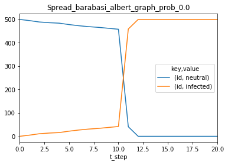

.. image:: output_55_1.png

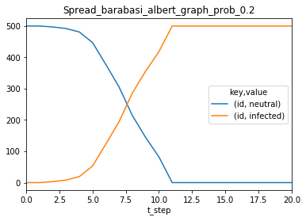

.. image:: output_55_3.png

.. image:: output_55_4.png

.. image:: output_55_5.png

.. image:: output_55_6.png

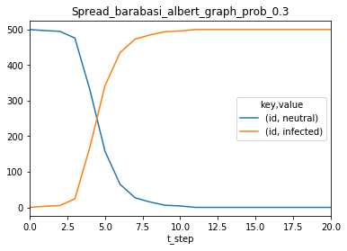

.. image:: output_55_8.png

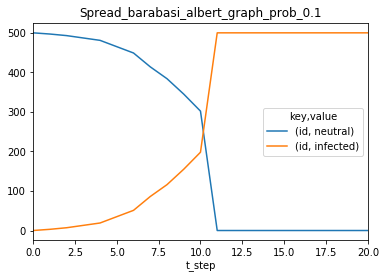

.. code:: ipython3

    plot_all('soil_output/Spread_erdos*', get_value, 'prob_tv_spread');

.. image:: output_56_1.png

.. image:: output_56_3.png

.. image:: output_56_4.png

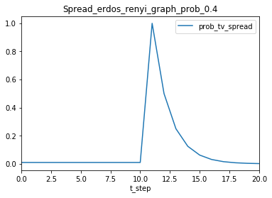

.. image:: output_56_7.png

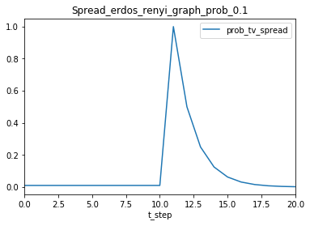

.. image:: output_56_9.png

Manually plotting with pandas
~~~~~~~~~~~~~~~~~~~~~~~~~~~~~

Although the simplest way to visualize the results of a simulation is to
use the built-in methods in the analysis module, sometimes the setup is
more complicated and we need to explore the data a little further.

For that, we can use native pandas over the results.

Soil provides some convenience methods to simplify common operations:

-  ``analysis.split_df`` to separate a history dataframe into
   environment and agent parameters.
-  ``analysis.get_count`` to get a dataframe with the value counts for
   different attributes during the simulation.
-  ``analysis.get_value`` to get the evolution of the value of an
   attribute during the simulation.

And, as we saw earlier, ``analysis.process`` can turn a dataframe in
canonical form into a dataframe with a column per attribute.

.. code:: ipython3

    p = read_sql('soil_output/Spread_barabasi_albert_graph_prob_0.0/Spread_barabasi_albert_graph_prob_0.0_trial_0.db.sqlite')
    env, agents = split_df(p);

Let's look at the evolution of agent parameters in the simulation

.. code:: ipython3

    res = agents.groupby(by=['t_step', 'key', 'value']).size().unstack(level=[1,2]).fillna(0)
    res.plot();

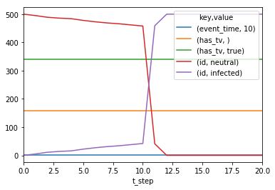

As we can see, ``event_time`` is cluttering our results,

.. code:: ipython3

    del res['event_time']
    res.plot()

.. parsed-literal::

    <matplotlib.axes._subplots.AxesSubplot at 0x7fd795b17b38>

.. image:: output_63_1.png

.. code:: ipython3

    processed = process_one(agents);
    processed

.. raw:: html

    

    
    <table border="1" class="dataframe">
      <thead>
        <tr style="text-align: right;">
          <th></th>
          <th></th>
          <th>event_time</th>
          <th>has_tv</th>
          <th>id</th>
        </tr>
        <tr>
          <th>t_step</th>
          <th>agent_id</th>
          <th></th>
          <th></th>
          <th></th>
        </tr>
      </thead>
      <tbody>
        <tr>
          <th rowspan="30" valign="top">0</th>
          <th>0</th>
          <td>0</td>
          <td>True</td>
          <td>neutral</td>
        </tr>
        <tr>
          <th>1</th>
          <td>0</td>
          <td>False</td>
          <td>neutral</td>
        </tr>
        <tr>
          <th>10</th>
          <td>0</td>
          <td>True</td>
          <td>neutral</td>
        </tr>
        <tr>
          <th>100</th>
          <td>0</td>
          <td>True</td>
          <td>neutral</td>
        </tr>
        <tr>
          <th>101</th>
          <td>0</td>
          <td>True</td>
          <td>neutral</td>
        </tr>
        <tr>
          <th>102</th>
          <td>0</td>
          <td>False</td>
          <td>neutral</td>
        </tr>
        <tr>
          <th>103</th>
          <td>0</td>
          <td>True</td>
          <td>neutral</td>
        </tr>
        <tr>
          <th>104</th>
          <td>0</td>
          <td>True</td>
          <td>neutral</td>
        </tr>
        <tr>
          <th>105</th>
          <td>0</td>
          <td>False</td>
          <td>neutral</td>
        </tr>
        <tr>
          <th>106</th>
          <td>0</td>
          <td>False</td>
          <td>neutral</td>
        </tr>
        <tr>
          <th>107</th>
          <td>0</td>
          <td>True</td>
          <td>neutral</td>
        </tr>
        <tr>
          <th>108</th>
          <td>0</td>
          <td>True</td>
          <td>neutral</td>
        </tr>
        <tr>
          <th>109</th>
          <td>0</td>
          <td>False</td>
          <td>neutral</td>
        </tr>
        <tr>
          <th>11</th>
          <td>0</td>
          <td>True</td>
          <td>neutral</td>
        </tr>
        <tr>
          <th>110</th>
          <td>0</td>
          <td>False</td>
          <td>neutral</td>
        </tr>
        <tr>
          <th>111</th>
          <td>0</td>
          <td>False</td>
          <td>neutral</td>
        </tr>
        <tr>
          <th>112</th>
          <td>0</td>
          <td>True</td>
          <td>neutral</td>
        </tr>
        <tr>
          <th>113</th>
          <td>0</td>
          <td>True</td>
          <td>neutral</td>
        </tr>
        <tr>
          <th>114</th>
          <td>0</td>
          <td>True</td>
          <td>neutral</td>
        </tr>
        <tr>
          <th>115</th>
          <td>0</td>
          <td>True</td>
          <td>neutral</td>
        </tr>
        <tr>
          <th>116</th>
          <td>0</td>
          <td>False</td>
          <td>neutral</td>
        </tr>
        <tr>
          <th>117</th>
          <td>0</td>
          <td>True</td>
          <td>neutral</td>
        </tr>
        <tr>
          <th>118</th>
          <td>0</td>
          <td>True</td>
          <td>neutral</td>
        </tr>
        <tr>
          <th>119</th>
          <td>0</td>
          <td>False</td>
          <td>neutral</td>
        </tr>
        <tr>
          <th>12</th>
          <td>0</td>
          <td>False</td>
          <td>neutral</td>
        </tr>
        <tr>
          <th>120</th>
          <td>0</td>
          <td>False</td>
          <td>neutral</td>
        </tr>
        <tr>
          <th>121</th>
          <td>0</td>
          <td>True</td>
          <td>neutral</td>
        </tr>
        <tr>
          <th>122</th>
          <td>0</td>
          <td>True</td>
          <td>neutral</td>
        </tr>
        <tr>
          <th>123</th>
          <td>0</td>
          <td>True</td>
          <td>neutral</td>
        </tr>
        <tr>
          <th>124</th>
          <td>0</td>
          <td>False</td>
          <td>neutral</td>
        </tr>
        <tr>
          <th>...</th>
          <th>...</th>
          <td>...</td>
          <td>...</td>
          <td>...</td>
        </tr>
        <tr>
          <th rowspan="30" valign="top">20</th>
          <th>73</th>
          <td>0</td>
          <td>True</td>
          <td>infected</td>
        </tr>
        <tr>
          <th>74</th>
          <td>0</td>
          <td>True</td>
          <td>infected</td>
        </tr>
        <tr>
          <th>75</th>
          <td>0</td>
          <td>True</td>
          <td>infected</td>
        </tr>
        <tr>
          <th>76</th>
          <td>0</td>
          <td>True</td>
          <td>infected</td>
        </tr>
        <tr>
          <th>77</th>
          <td>0</td>
          <td>True</td>
          <td>infected</td>
        </tr>
        <tr>
          <th>78</th>
          <td>0</td>
          <td>True</td>
          <td>infected</td>
        </tr>
        <tr>
          <th>79</th>
          <td>0</td>
          <td>False</td>
          <td>infected</td>
        </tr>
        <tr>
          <th>8</th>
          <td>0</td>
          <td>False</td>
          <td>infected</td>
        </tr>
        <tr>
          <th>80</th>
          <td>0</td>
          <td>True</td>
          <td>infected</td>
        </tr>
        <tr>
          <th>81</th>
          <td>0</td>
          <td>False</td>
          <td>infected</td>
        </tr>
        <tr>
          <th>82</th>
          <td>0</td>
          <td>False</td>
          <td>infected</td>
        </tr>
        <tr>
          <th>83</th>
          <td>0</td>
          <td>True</td>
          <td>infected</td>
        </tr>
        <tr>
          <th>84</th>
          <td>0</td>
          <td>False</td>
          <td>infected</td>
        </tr>
        <tr>
          <th>85</th>
          <td>0</td>
          <td>True</td>
          <td>infected</td>
        </tr>
        <tr>
          <th>86</th>
          <td>0</td>
          <td>True</td>
          <td>infected</td>
        </tr>
        <tr>
          <th>87</th>
          <td>0</td>
          <td>True</td>
          <td>infected</td>
        </tr>
        <tr>
          <th>88</th>
          <td>0</td>
          <td>False</td>
          <td>infected</td>
        </tr>
        <tr>
          <th>89</th>
          <td>0</td>
          <td>False</td>
          <td>infected</td>
        </tr>
        <tr>
          <th>9</th>
          <td>0</td>
          <td>True</td>
          <td>infected</td>
        </tr>
        <tr>
          <th>90</th>
          <td>0</td>
          <td>True</td>
          <td>infected</td>
        </tr>
        <tr>
          <th>91</th>
          <td>0</td>
          <td>True</td>
          <td>infected</td>
        </tr>
        <tr>
          <th>92</th>
          <td>0</td>
          <td>True</td>
          <td>infected</td>
        </tr>
        <tr>
          <th>93</th>
          <td>0</td>
          <td>False</td>
          <td>infected</td>
        </tr>
        <tr>
          <th>94</th>
          <td>0</td>
          <td>True</td>
          <td>infected</td>
        </tr>
        <tr>
          <th>95</th>
          <td>0</td>
          <td>True</td>
          <td>infected</td>
        </tr>
        <tr>
          <th>96</th>
          <td>0</td>
          <td>True</td>
          <td>infected</td>
        </tr>
        <tr>
          <th>97</th>
          <td>0</td>
          <td>True</td>
          <td>infected</td>
        </tr>
        <tr>
          <th>98</th>
          <td>0</td>
          <td>False</td>
          <td>infected</td>
        </tr>
        <tr>
          <th>99</th>
          <td>0</td>
          <td>True</td>
          <td>infected</td>
        </tr>
        <tr>
          <th>NewsEnvironmentAgent</th>
          <td>10</td>
          <td>False</td>
          <td>0</td>
        </tr>
      </tbody>
    </table>
    
10521 rows × 3 columns

    

Which is equivalent to:

.. code:: ipython3

    get_count(agents, 'id', 'has_tv').plot()

.. parsed-literal::

    <matplotlib.axes._subplots.AxesSubplot at 0x7fd799c15748>

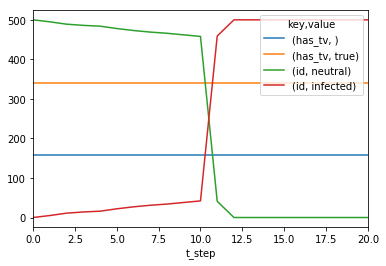

.. code:: ipython3

    get_value(agents, 'event_time').plot()

.. parsed-literal::

    <matplotlib.axes._subplots.AxesSubplot at 0x7fd79a228c88>

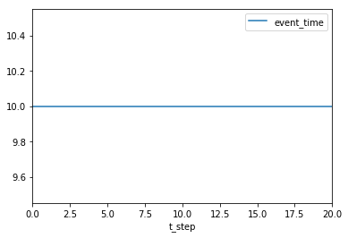

Dealing with bigger data
------------------------

.. code:: ipython3

    from soil import analysis

.. code:: ipython3

    !du -xsh ../rabbits/soil_output/rabbits_example/

.. parsed-literal::

    267M	../rabbits/soil_output/rabbits_example/

If we tried to load the entire history, we would probably run out of
memory. Hence, it is recommended that you also specify the attributes
you are interested in.

.. code:: ipython3

    p = analysis.plot_all('../rabbits/soil_output/rabbits_example/', analysis.get_count, 'id')

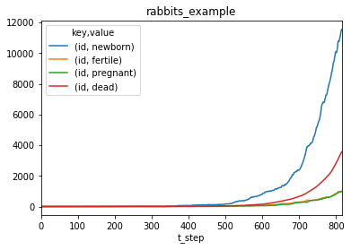

.. image:: output_72_1.png

.. code:: ipython3

    df = analysis.read_sql('../rabbits/soil_output/rabbits_example/rabbits_example_trial_0.db.sqlite', keys=['id', 'rabbits_alive'])

.. code:: ipython3

    states = analysis.get_count(df, 'id')
    states.plot()

.. parsed-literal::

    <matplotlib.axes._subplots.AxesSubplot at 0x7fd799b5b2b0>

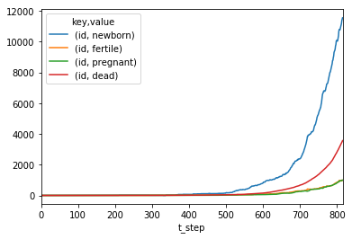

.. code:: ipython3

    alive = analysis.get_value(df, 'rabbits_alive', 'rabbits_alive', aggfunc='sum').apply(pd.to_numeric)
    alive.plot()

.. parsed-literal::

    <matplotlib.axes._subplots.AxesSubplot at 0x7fd796161cf8>

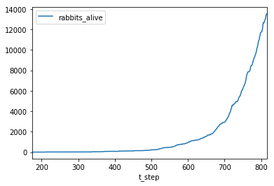

.. code:: ipython3

    h = alive.join(states);
    h.plot();

.. parsed-literal::

    /home/jfernando/.local/lib/python3.6/site-packages/pandas/core/reshape/merge.py:551: UserWarning: merging between different levels can give an unintended result (1 levels on the left, 2 on the right)
      warnings.warn(msg, UserWarning)

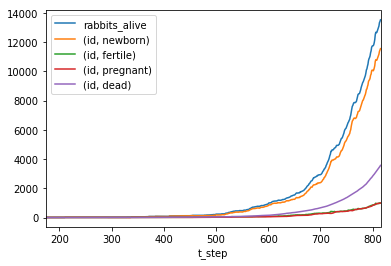

.. code:: ipython3

    states[[('id','newborn'),('id','fertile'),('id', 'pregnant')]].sum(axis=1).sub(alive['rabbits_alive'], fill_value=0)
